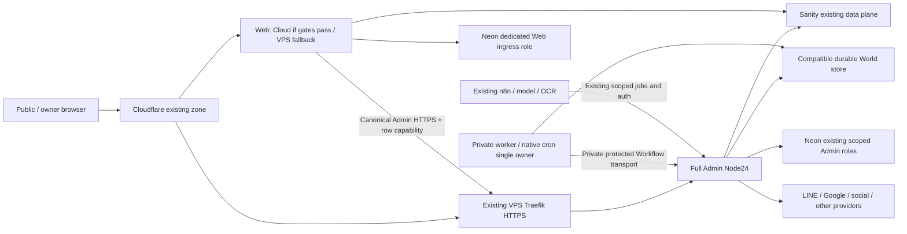
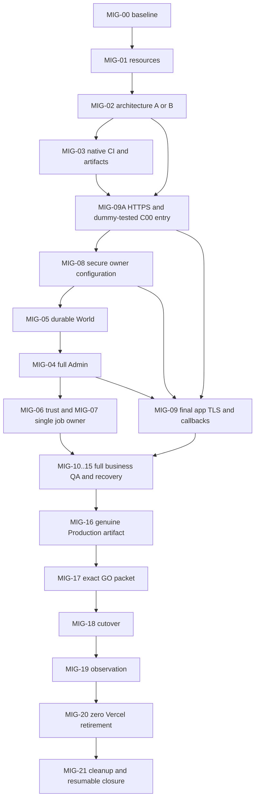

# แผนย้าย Production Web + Admin เต็มระบบไป Hostinger — 2026-09-30

**สถานะ: แผนปฏิบัติและ handoff; Production migration ยังไม่สำเร็จ / NOT READY FOR CUTOVER.** เป้าหมายล่าสุดของ COO คือ `ccpun.com`, `www.ccpun.com`, `admin.ccpun.com` และ execution ทุกส่วนที่เคยอยู่บน Vercel ต้องทำงานโดยไม่พึ่ง Vercel 100% เมื่อปิดงาน ไม่ใช่จบที่ editorial candidate หรือย้าย DNS แล้วถือว่าเสร็จ

Receipt เดิม: `hostinger-pre-dns-readiness-20260930`. ส่วนภาษาไทยนี้เป็นแผนปัจจุบันและแทนที่ข้อสรุปเก่าเรื่องเก็บ Admin/operations/scheduler บน Vercelหรือเกษียณเฉพาะ Web. ภาคประวัติท้ายไฟล์เก็บไว้เพื่อ audit เท่านั้น แผนนี้ไม่สั่งรันคำสั่ง provider, เปิด credentials, publish, DNS, merge หรือซื้อบริการในรอบเขียนแผน; owner/parent ดำเนินงานตาม task และ gate ที่ระบุ โดยไม่ขออนุมัติงานที่ได้รับอนุญาตซ้ำ

## ลำดับสำหรับเจ้าของระบบ

1. **ทีมเตรียมก่อน:** ตรวจระบบที่ใช้อยู่ สำรองและทดลองกู้คืน เลือก Cloud + VPS เดิม หรือ VPS เดิมทั้งสองแอปตามผลตรวจจริง โดยยังไม่เปลี่ยน DNS
2. **ทีมทำทางเข้าที่ปลอดภัย:** เตรียม HTTPS และช่องทางใส่ค่าตามคู่มือเจ้าของ ทดสอบด้วยค่าจำลองให้ผ่านก่อนส่งให้คุณใช้ ขั้น C00 ในคู่มือผูกกับ MIG-02, MIG-09A และ MIG-08; ไม่สร้างแผง Admin ใหม่เพื่อรับรหัส
3. **คุณใส่เฉพาะชุดที่ทีมระบุ:** กรอกในช่องทางที่ตรวจแล้ว ทีมเห็นเพียงว่ามีค่าและสิทธิ์ถูกต้อง ไม่ส่งรหัสในแชท ชุดทดสอบกับชุดจริงแยกกัน
4. **ทีมตรวจทั้งระบบ:** ทดสอบเข้าใช้ แก้บทความ เผยแพร่ตัวอย่างที่อนุมัติ ตั้งเวลา LINE เครื่องมือ SEO และระบบงานอื่น รวมถึงการรีสตาร์ทและกู้คืน งานที่ต้องส่งหรือเผยแพร่จริงใช้ขอบเขตที่คุณอนุมัติเท่านั้น
5. **ย้าย DNS เมื่อหลักฐานครบ:** ใช้รายการเปลี่ยนแปลงที่ระบุค่าก่อน/หลังชัดเจน พร้อมระบบเดิมที่กู้กลับได้ และให้มีผู้ทำงานคิวเพียงชุดเดียว
6. **เฝ้าดูและหยุด Vercel:** ตรวจเว็บและงานเบื้องหลังในระยะที่ตกลงก่อน หยุดทั้งสองโปรเจกต์แบบเปิดกลับได้เมื่อไม่มีส่วนใดต้องพึ่ง Vercel แล้ว
7. **เก็บกวาดและส่งมอบ:** เก็บหลักฐานและวิธีกู้คืน ปิดของทดสอบที่ไม่ใช้ การลบถาวรหรือยกเลิกบริการระบุรายการให้คุณตัดสินใจแยก งานยังไม่ถือว่าจบจน Production ทำงานครบจริง

## 1. ขอบเขต “ครบ Production” และแหล่งอ้างอิง

- Web: ทุกหน้า/บทความ/เครื่องมือ/export/CTA/ฟอร์ม, API LINE, image optimizer, static/font/public files, sitemap/robots/redirect/canonical/JSON-LD, consent/GA4/GTM/Meta และ continuation หลัง response
- Admin: Auth.js/Google/session/RBAC ครบหกบทบาท; Studio/editorial/review/SEO/research/Preview/manual publish; durable article scheduling; LINE/CRM/private archive/media/privacy/campaign; Social/marketing/analytics/export/Agent OS/Local AI/operations/settings และ APIs/cron ของระบบเหล่านี้
- Execution: ไม่เหลือ Vercel Function, Cron, Workflow World/transport, injected OIDC, provider health query, deploy hook/promotion job หรือ Vercel alias ที่บริการจำเป็นต้องเรียก การเก็บ reference ประวัติที่ไม่ถูกใช้รันงานไม่ใช่ execution dependency
- Data/service planes เดิมคงอยู่: Sanity, Neon, LINE, Google/Meta/YouTube/TikTok/Ubersuggest, Cloudflare, n8n และ VPS model ตามสัญญาปัจจุบัน ไม่ย้ายหรือเปลี่ยน schema/data โดยรวมเพียงเพื่อเปลี่ยน hosting และไม่เปิด legacy workflow ที่เดิมไม่ทำงานเพื่อทำให้รายชื่อดูครบ
- URL/content/event contracts เดิมต้องคงอยู่ ไม่มี migration slug/category/taxonomy, เขียนบทความใหม่, rename events หรือสร้าง SEO/CRM platform ใหม่ในงานนี้

“100%” หมายถึงALL active existing capabilitiesย้ายและรักษาintentional-disable policyของoptionalprovider/privatejobs/Adminreply/paidwritesเดิม ไม่ใช่เปิดflagทุกตัวให้ทำงาน. ต้องบันทึกactive/disabled/unconnected/legacyจากsource+providerreadbackพร้อมownerและเหตุผล; disabledโดยนโยบายเดิมสามารถคงdisabledได้ แต่requiredfunctionที่ทำงานอยู่แล้วจะถูกเรียก deferred แล้วถือว่าจบไม่ได้

หลักฐานฉบับใช้งานอยู่ใน `CCPun-Financial Advisor Project/Dev/Reports/` (เอกสาร local ใน Codex ไม่ใช่ไฟล์ที่ GitHub จะเปิดข้าม worktree ได้):

- [รายงานสถานะและ provider/CI evidence](</Users/punnii/Desktop/CCPun x AI/CCPun-Financial Advisor Project/Dev/Reports/2026-09-30-hostinger-pre-dns-readiness.md>) และ [JSON หลักฐาน provider](</Users/punnii/Desktop/CCPun x AI/CCPun-Financial Advisor Project/Dev/Reports/2026-09-30-hostinger-pre-dns-evidence.json>)
- [LINE / full Admin / durable backend / auth / TLS review](</Users/punnii/Desktop/CCPun x AI/CCPun-Financial Advisor Project/Dev/Reports/2026-09-30-hostinger-line-pre-dns.md>) — อ่าน appendix ล่าสุด; ข้อเสนอ Admin-on-Vercel เก่าเป็นประวัติ
- [คู่มือ owner ใส่ค่าผ่านช่องทางปลอดภัย](</Users/punnii/Desktop/CCPun x AI/CCPun-Financial Advisor Project/Dev/Reports/2026-09-30-hostinger-production-owner-guide.md>) — Security เป็นผู้เขียน; ค่าจริงไม่อยู่ในแผน/แชท/Git/command arguments
- [audit ก่อนแก้](</Users/punnii/Desktop/CCPun x AI/CCPun-Financial Advisor Project/Dev/Reports/2026-09-30-hostinger-pre-cutover-audit.md>) และ `/tmp/hostinger-admin-editorial-implementation-20260930.md` เป็นหลักฐาน bounded source/local ก่อนหน้า

Agent รอบถัดไปต้องเปิด receipt/HANDOFF/shared state ที่ parent เก็บก่อนทำงาน ใช้แผนนี้ระบุ task ที่ยังไม่ผ่าน ตรวจหลักฐานอ้างอิงที่ยังมีอยู่ แล้วอ่าน source ปัจจุบันใน task นั้น ห้ามสร้างงานซ้ำจาก title หรือใช้ `/tmp` ที่หายไปเป็นหลักฐานผ่าน

## 2. Checkpoint ที่พิสูจน์แล้ว และขอบเขตของหลักฐาน

Snapshot ต่อไปนี้อ้างอิง read-back ของ parent วันที่ 2026-09-30 ต้องอ่านใหม่ก่อนการเปลี่ยนแปลงจริง:

| ชั้นหลักฐาน | สิ่งที่ CONFIRMED | สิ่งที่ยังไม่พิสูจน์ |
| --- | --- | --- |
| Source | Production remote `3bba7c662c539f0aecb6677b5cfc9020ef6740db`; preparation branch `codex/hostinger-pre-dns-20260930`; Draft PR [313](https://github.com/punniix/CCPun-Update-4.0/pull/313), head ก่อนแผนนี้ `f46d0013c6dfb50bf352ce63690d32852807164d`; packaging/robots/redirect headers, editorial guards และ bounded native LINE capability gate แก้แล้ว | Full Hostinger Admin profile ยังไม่รองรับ; durable World/native diagnostic ยังไม่ย้าย |
| Local | Next16.3.6/Undici7.29.1; foundation1,022 assertions + contracts/TS ผ่าน, lint0errors2warningsเดิม; Web strict235 observations/17manifest ผ่าน; Admin negative/auth/bootstrap/browser ผ่าน; selective install→root-lock bootstrap build ผ่าน | OAuth/actual Sanity publication/LINE positive/provider lifecycle ไม่ได้พิสูจน์ด้วย fixture |
| CI | Required `verify` [36676242215](https://github.com/punniix/CCPun-Update-4.0/actions/runs/36676242215) SUCCESS06:07:38Z; Web/Admin/privacy/Hostinger shadow checksผ่าน; Promote Admin SKIPPED บน branch; Linux optional lock entriesคืนใน `aae40e33` | ไม่มี Production merge หรือ native full Admin runtime จาก CI นี้ |
| Hosted build/HTTP | Real Hostinger Web `ccpun.com` build `01a0f0b9-a849-70cf-89dd-8aa4e0d20e07` จาก `b72d346c`; real Admin `admin.ccpun.com` build `01a0f0d2-c117-7223-8949-fd8be86b48f5` จาก `aae40e33`; direct-origin finite HTTP ตรวจ canonical/robots/CSP และ private guards ผ่านตามรายงาน | Temporary managed preview rewrite/header/robots discrepancy ยังมี; HTTPไม่พิสูจน์ TLS/secure cookies; ไม่ใช่ fullAdmin/owner workflow acceptance |
| Final HTTPS/business | ยังไม่มี final-domain TLS ที่ผ่านพร้อม native owner flow | TLS/SNI/OAuth/content freshness/LINE/durable jobs/whole operations/recovery/load/rollback ยัง NOT VERIFIED |

`white-panther-592861.hostingersite.com` คือ Web TEST และ `peru-squid-301704.hostingersite.com` คือ Admin TEST เท่านั้น ห้าม rename/connect ให้แทนของจริง. Hostinger real Web/Admin ถูกเตรียมแยกแล้ว; public traffic ยังอยู่ Vercel. Backup `default.php` เดิมของ real Web ถูกเก็บก่อน deploy. Candidate ยัง editorial, delivery off, ไม่ได้ใส่ auth/read/write secrets. ไม่ยกระดับคำว่า build COMPLETED, HTTP200, source SHA หรือ passing checker ให้เป็น live business proof

Parent scoped-repository Vercel read-backพบexacttwo projects; Production READY recovery deployments: Web `dpl_GyzoYQ47uDU5cNXKjJW5yyn8R8iJ` (`ccpun-8f1amxs1n-punniixs-projects.vercel.app`), Admin `dpl_GTSgfxKjyajPGYQUGXokQM52164x` (`ccpun-admin-25tlfn4ds-punniixs-projects.vercel.app`) ทั้งคู่SHA`3bba7c6`. เป็นtargetProduction-filtered snapshot ไม่ใช่latestPreview; ต้องrefreshก่อนrollbackและพิสูจน์TLS/OAuth/servicelease ไม่ใช้deploymentaliasเป็นsupportedownerloginโดยสมมติ

## 3. ทางเลือก execution และ VPS ที่มีอยู่จริง

**ทางเลือกแรกแบบมีเงื่อนไข:** Web Node24 บน Hostinger Cloud real website; Full Admin Node24 + durable worker/cron อยู่บน VPS เดิมผ่าน Traefik เดิม. Web→Admin ใช้ endpoint canonical เดียว `https://admin.ccpun.com/api/internal/line/system-delivery/dispatch/` พร้อม existing row-bound capability ไม่ใช้ Vercel relay, HTTP/self-signed cross-provider หรือเปิด bearer กลางให้ทุก API. Browser auth ใช้ real Admin HTTPS origin; task-specific n8n/Agent OS keys แยกตามสิทธิ์เดิม

| ทางเลือก | เลือกเมื่อ | เกณฑ์ตัดสินก่อน deploy |
| --- | --- | --- |
| Cloud Web + VPS Full Admin/worker | Cloud พิสูจน์ real-domain TLS/renewal, original URLs/effective headers/cache และ `after()` request lifetime ได้; VPS ผ่าน resource/security/worker gates | Traefik routing/TLS ของ Admin + direct PG/compatible World/private transport + full operations acceptance |
| VPS-only Web + Full Admin/worker | Cloud ไม่มี supported pre-DNS TLS/import/renewal หรือ headers/robots/URL rewrite/`after()` ที่พิสูจน์ได้ | เพิ่ม isolated Web service/router ใน Traefik เดิม; capacity/load/recovery ทั้ง Web+Admin+existing AI/n8n ผ่าน; Cloud real websiteคงเป็น recovery/testที่ปิด indexing ตามแผน ไม่ลบทันที |
| Cloud ทั้งคู่ | เป็น optional investigation เท่านั้น หาก providerพิสูจน์ worker lifetime/private routing/PG LISTEN/cron/securityได้จริง | ไม่เลือกจากคำว่า “Node supported”; ต้องผ่านเกณฑ์เหมือน VPSและมีการควบคุม full profile/Workflow routes |



VPS fallbackของWebเพิ่มservice/routerแยกในTraefikเดิม ไม่ใช้plainHTTPVPS→Cloudเป็นoriginเพื่ออ้างว่าSSLแก้แล้ว. Container loopback/private transportต้องมีreviewednetworkboundary; trafficที่ข้ามprovidersต้องcanonicalvalidatedHTTPS

### VPS baseline จาก parent MCP ไม่ใช่คำรับรอง capacity

VPS `908107` / `srv908107.hstgr.cloud`, KVM2 running:2vCPU,8192MiBRAM,102400MiBdisk, IPv4 `72.60.99.20`. Metrics61samplesช่วง2026-09-29T00:18:24Z→2026-09-30T06:18:43Z: CPUล่าสุด3.79%/สูงสุด8.65%; RAMล่าสุด1,296,105,472bytes(~1.21GiB)/สูงสุด1,639,309,312(~1.53GiB); diskล่าสุด17,050,533,888(~15.88GiB). ค่าช่วงนี้ยังไม่วัด model inference/OCR/Next build/peak trafficพร้อมกัน จึงไม่รับรองว่าเพิ่มทุกระบบได้หรือควรซื้ออะไร

- มี Docker stacks `ccpun-local-ai` (worker+Ollama), `ccpun-ocr`, `root` (n8n+Traefik). Traefikจับ80/443ทั้งIPv4/IPv6อยู่แล้ว; n8n bind127.0.0.1:5678; Ollama11434อยู่ใน containerไม่ published
- **ห้ามตั้ง Nginx/Caddy/Traefikตัวใหม่แย่ง80/443, overwrite root compose, reinstall, rebootทุกระบบ หรือ expose Ollama/n8n/model/privateworkerเพื่อแก้ migration.** เพิ่ม isolated services/network/routerผ่าน existing Traefikหรือทำ reviewed transition ตาม exact configจริง
- Traefik actual routers/networks/certificate resolver/secret mounts ยัง NOT READ/NOT VERIFIED. สำรวจเฉพาะ metadata/topologyและ sanitized configuration ภายใต้ owner scope; ไม่ dump `.env`/secret values. ไม่ใช้ source compose เป็นหลักฐานแทน configurationที่รันอยู่
- Source `workers/local-ai/docker-compose.yml` จำกัด Ollama5500m + worker512m, OCR1200m (+model-init1400m transient). Live limitsและ concurrent actualusageต้องอ่านกลับ; ต่ำใน baselineไม่ตัด OOM risk. Prefer build pinned artifactsใน CI/isolated builderก่อนส่งVPS; หลีกเลี่ยง peak Next/Studio buildแข่ง inference โดยไม่มีงบทรัพยากร
- MIG-01 ต้องวัดCPU/RAM/swap/disk/inode/OOM/restart/queue latency/networkภายใต้โหลดร่วม, กำหนด service budgets/pids/concurrency ก่อนทดสอบ, ตรวจ actual free disk/backup retention/registry restore. ถ้าไม่ผ่านให้ลดconcurrencyหรือแยกexecutionที่พิสูจน์ได้; ห้ามสรุปซื้อบริการใหม่โดยอัตโนมัติ
- Backupล่าสุดที่พบSep23T09:32:43Z ID53241100เป็นของเก่า ไม่ใช่ freshrestore proof. SnapshotAPIคืนid0/restore_time0 ไม่พบ usable snapshot; creationอาจ overwriteexisting จึงต้องinspect exactidentityก่อนใช้. `firewall_group_id=null` พิสูจน์แค่provider groupไม่attached ไม่ได้พิสูจน์ host/firewall/securityไม่มี

## 4. Source work ที่ยังต้องทำให้ครบก่อน Full Admin

1. **Full profile:** current `apps/admin/next.config.ts:10` และ `apps/admin/scripts/build-provider.mjs` ยอม Hostingerเฉพาะeditorial; configท้ายไฟล์เรียก `withWorkflow()` เฉพาะfull. ต้องเปิด native full profileด้วย reviewed durable-runtime/network gateและ compiledmarkerชัดเจน ห้ามลบeditorialflagแล้วถือว่าครบ. ขยาย native rawHost/forwardedHost guardไปfullก่อนservice bypass; preserve six-roleRBAC/origin/private/noindex/legacyalias/unknownAPI tests
2. **Workflow compatibility:** lockมีworkflow/core4.8.9, World4.5.0, local4.4.1, Vercel4.7.4; ไม่มีWorldPostgres. ReportตรวจupstreamSep29เป็น5beta ไม่ใช่หลักฐานเข้ากับ4.x. เลือก compatibleversionที่พิสูจน์ได้หรือทำ bounded reviewedupgradeทั้งcontract; ห้ามเติมoverrideมั่วหรือ deployfilesystemWorld `local`
3. **Durable World/worker:** dedicatedschema/role, direct PostgreSQL/LISTENและworker supervision; private loopback/networkสำหรับSDKflow/step transport; deny external `/.well-known/workflow/*`ก่อนถึงuntrustedhandler; keep requestbody intact ไม่ผ่านmiddlewareที่อ่าน/เปลี่ยนbody. Package referenceไม่ได้authenticateHTTPเอง. ต้องทดสอบ absoluteUTC/Bangkok due, lease/generation, frozenrevision, cancel/reschedule, restart/redeploy, concurrency, uncertain writes/reconciliation และ zero duplicatepublish

   Existing encrypted VercelWorkflowrunstateไม่portableโดยสมมติ. InventoryrunIDs/queuegenerations/cancelstate/leases/side-effectacks; drainหรือcanceloldrunอย่างตรวจรับแล้วre-enqueueจากapprovedfrozenarticle revision/generationตามreviewedmigrationcontract ไม่copyrawencryptedWorldstateหรือstartfuturejobsสองWorldพร้อมกัน. Jobsที่ส่ง/เผยแพร่แล้วหรือunknownoutcomeต้องreconcileก่อน ไม่replayโดยอัตโนมัติ
4. **Provider-neutral trust/health:** `lib/runtime/line-bridge-probe.ts` กับ `lib/admin/line/web-service-auth.ts` ยังverifyVercelOIDC. Inventory liveusageก่อนreplace/retire; native healthต้องแสดงfresh/stale/not-verifiedตามจริง. ใช้ Admin own probe/storedsanitizedWebhealthได้; ถ้าservicecrosshostที่จำเป็นจริงยังเหลือ ให้Securityออก scopedidentity/mTLS/private-network designที่มีaudience/action/replay controls แยกkeyตามหน้าที่ ไม่reuseLINEencryption/businesscapabilityเพื่อhealthทั่วไปและไม่spoof`VERCEL_*`
5. **Provider-specific health/digests:** แทนVercel deployment API/readtokenในoperations/deployment viewsด้วยactualHostinger/VPS release/process evidence; `lib/admin/control-plane/provider-state.ts:155` และ `lib/admin/line/control-plane.ts:587` มีVercelID→local fallback ต้องreview stable nativeworker/releaseidentity พร้อมtests ไม่อ้าง localfallbackเป็น nativehealthจริง
6. **CI delivery:** `.github/workflows/seo-topic-hubs-ci.yml` มีproductionpush→`scripts/promote-admin-after-ci.mjs` ใช้VERCEL_TOKEN; เปลี่ยนเป็นexactverifiednativeartifact release/deploy flowก่อนProductionmerge. แยก Web/Admin deploymentintentตามchangedpathsและlease/cutover state; no auto deploymentที่ข้ามgates. Preserve Ubuntu24/Node24 strictnpmci+foundation/privacy/SEO/analytics checks
7. **Background migration:** ย้ายสองจริงVercelCronและinventoryn8n/GitHub/providerdashboard hooks. Native invokerต้องเก็บcredentialในsecuremechanism ไม่ใส่croncommand/chat/log; private endpoints+boundedtimeout+no overlap+failureaudit. การย้ายcronไม่เปลี่ยนmarketing/review/businessapprovalcontracts

## 5. Inventory ระบบ:ทุกกลุ่มมี owner และ acceptance

Appendix API/page/envด้านล่างดึงจาก trackedsourceของcheckpointนี้ ไม่ใช่รายการที่อนุมานจาก UI. ก่อนreleaseให้ refreshmanifestและdiff against deployedbuild; generatedSDKroutes/static rewrites/aliases/CloudflareWorkerต้องนับด้วย ไม่เพียง `route.ts`

| ระบบ / actual module owner | Acceptance ที่ต้องรักษา | ผู้รับผิดชอบ |
| --- | --- | --- |
| Web `apps/web`, `lib/content`, `lib/seo`, public/assets, FHC/CIfeatures | HTML+redirect/slash/query+404, optimized/local/remoteimages, fonts, exports/downloads, keyboard/mobile, outboundCTAsและฟอร์มตามsource | Ek+Fa; Tonสำหรับconversion |
| Auth/RBAC `auth.ts`, `lib/admin/auth-config.ts`, `rbac.ts`, proxy/host-routing | owner/editor/seo-manager/reviewer/analyst/viewer permitted/deniedmatrix; securecookie/login/logout/expiredsession/CSRF/origin/rawHost; privatepreview/API noleak | Security+owner+Fa |
| Editorial `cms/sanity`, `lib/admin/article-*`, content/reviews | exactdocumentID/revision/URLlock, save/reopen/source/SEO/review/apply/manualpublish/Preview; publishedonlyWeb, nofuture/draftleak | Ek+owner+Security+Fa |
| SEO/research `lib/admin/seo-*`, `seo-intelligence`, `research*` | source/proposals/audit/revision/reviewcontrols; GSC/GA4/Ubersuggestrefresh/scopes/readiness/manualsync; storedopportunities/exportretainas-of/stale | Ek+Security+Fa; ownerOAuth |
| ArticleScheduler `article-publication-workflow`, `article-scheduling`, `operations/article-schedule-*` | start/sleep/absoluteUTC, durablelease/generation/revision/cancel/retry/restart/uncertainoutcome และเพียงหนึ่งexecutor | Ek+Jay+Security; Fa fault tests |
| LINE/CRM/privacy `lib/admin/line`, Webprivate-ingestion, `lib/line` | signedingress+dedup/unsend/encryption/dedicatedDB; continuation/systemdispatch; inbox/history/notes/OCR/evidence/revenue/attribution/implementation/campaign/richmenu/media/privatearchive/privacyretention | Ek+Security+owner; syntheticreceiverเมื่ออนุญาต |
| Social `lib/admin/social`, publication/drafts/providerroutes | freezeapprovedcontent, providergrant/connection, workerlease/cancel/reschedule/no duplicatewrite, media/audio/ratebudget; storedmetrics/backfill/postlive/sheets | Ek+Jay+Security+owner; Fa |
| Analytics/marketing `lib/admin/analytics`, `lib/admin/marketing` | storedbatch/latest-success/as-of/last-attempt/stale/exportlineage; collection/assessment/actionimportไม่เปลี่ยนงบ/adsอัตโนมัติ; compare/source/windowexistingcontract | Ek+Jay+Ton+owner |
| AgentOS/LocalAI `lib/admin/agent-os`, `lib/admin/local-ai`, `lib/local-ai`, `workers/local-ai` | queue/lease/ack/expiry/exportservice-scopedauth, encryptedprivatejobboundary; VPSmodel/OCR/n8nexistingservicesไม่ถูกเปิดpublicหรือreset | Jay+Ek+Security |
| Media/export `lib/admin/media`, `agent-os/export-*`, GoogleDrive | uploadintent+permission/byte/type/rate limits, callback/picker/origin; XLSX/CSV/SheetsมีThaireadable/sourcewindow/as-ofและprivatecache; exportไม่fetchsourcesซ้ำ | Ek+Security+owner+Fa |
| Operations `lib/admin/operations`, `control-plane`, settings/providers | runtime/job/deployment/health/incidents/action/auditviewsจากnativeactualstate; deniedcommands/profile/providerrole; noVercelcredential required forcoreview | Ek+Security+Fa |

### Cron, Workflow, hooks และ external execution

- Actual `apps/admin/vercel.json`: GET `/api/admin/social/worker` และ GET `/api/internal/line/rich-menu/reconcile/` ทุก`*/5 * * * *` ทั้งคู่ใช้`CRON_SECRET`; missingsecret503/unauthorized401. ต้องnativeinvoker+sameauth/cadence+oneowner proof ไม่เปลี่ยนเป็นpubliccron
- Schedule POSTrouteใช้`start()`; `lib/admin/article-publication-workflow.ts`ใช้`await sleep(new Date(scheduledAt))`แล้วbounded5sackwait/zero stepretriesonuncertainwrites. NativeWorld workerแยกจากสองcronsข้างบนและจากn8n ต้องinventoryrunIDs/generation/leaseก่อนย้าย
- `apps/web/lib/line/private-ingestion.ts:315`และAdminingestionใช้Next`after()`ส่งexistingcapabilityไปAdmin. ทดสอบ responsefinished/idle/restart/crash/timeout/retry/reconciliation; หากCloudroute-lifetimeไม่พอ ให้แก้durabilityแบบreviewedหรือเลือกWebVPS ไม่เก็บVercelFunctionsแอบไว้
- `.github/workflows/`มี6sourceworkflows: FoundationCI, monorepo shadow, Hostingerreadiness, Vercelmonorepoaudit, articleschedulingsafety, Sanityprivacy. YAMLไม่พบscheduledGitHubcronในการinventoryนี้ แต่manualdashboard/externalhooksยังต้องreadback. Vercelpromotion/auditsecretต้องไม่เป็นactivefinaldependency
- `workers/contact-proxy`เป็นCloudflareWorker source route`ccpun.com/api/contact*`→existingn8n signedcontact; ไม่ใช่VercelFunction และไม่ย้ายออกจากCloudflareโดยเดา. VerifyactualWorkersroute/DNSproxybehavior, fixedorigin, rawbody/HMAC/rate/timeout/no-send sink; directCloudDNS-only flowต้องไม่ bypassworker. ตรวจFHCLeadn8nแยก
- `lib/admin/n8n-integration-registry.ts`: actualadmin-trigger LINECardCopy/OCR/OwnerSheets; background OperationsMonitor/ContactForm/FHCLead; test-onlySmoke; unconnectedClustering/Preprocess/Tagging; legacyarticle-publish/social-post/report/cost/adsworkflow. Sourcecategoryไม่พิสูจน์activeproviderstate; inspectworkflowIDs/trigger/callback/serviceauthแต่ไม่activatelegacy/unconnectedโดยชื่อและไม่ทำduplicatepublisher

## 6. Credentials, identity และ Production provenance

**ค่าจริง owner ใส่เองผ่าน secure provider/VPS secretmechanismตามowner guide.** Agentsตรวจเฉพาะkeyname/presence/scopes/role/lane/rotationmetadata; ไม่read`.env*`, copyVercelvalues, printJWT/token/URLpassword หรือใส่secretในbuildargs/command/history. หยุดเมื่อถึงlogin/manualauth. `NEXT_PUBLIC_*`เป็นbuild-timepublicmarker/ID ห้ามใส่secret; flag/secretเปลี่ยนruntimeไม่แก้publicartifactที่compileแล้ว

| Lane | Environment/data | Identity/flags |
| --- | --- | --- |
| Web isolatedUAT | `web-uat`, Sanity`ccb9lnw5/uat` | Hostinger/web; realUATref/SHA; stage shadow/UAT1/analytics0 |
| Admin isolatedUAT | `admin-uat`, Sanity`ccb9lnw5/uat`, dedicatedUATNeonroles | Hostinger/admin; UATGoogleclient/owner; requiredcapabilitiesเปิดเฉพาะtest; noProductionkeys |
| Production-readcandidate | Web`production`; Admin`production-admin`; publicSanity`kyfxgjnq/production` | exactfeatureSHA/ref; Webcandidate/UAT1/analytics0; Adminprivate/editorial/deliveryfalse; Studiouserอาจมีwriteสิทธิ์จึงอย่าเรียกว่าenforcedread-only |
| FinalProduction | Web`production`; Admin`production-admin`, `kyfxgjnq/production`และexistingapprovedNeonProductionroles | `CCPUN_GIT_REF=v4-production`, actualmergedSHA/releaseID/providerrole; Weblive/UAT0/analytics1; AdminapprovednativeFULLprofile; service/writeflagsเฉพาะที่ผ่านpositiveacceptance |

ใช้canonicalkeys `CCPUN_RELEASE_STAGE`, `CCPUN_ENABLE_PRODUCTION_ANALYTICS`; unprefixedaliasesไม่ใช่sourcecontract. ห้ามตั้งfake`VERCEL_*`เพื่อผ่านlegacyguard. Production LINE/operations บางส่วนrequireexactproductionref; featurecandidatenegativefailclosedเป็นexpected ไม่แก้SHA/refให้เป็นของProductionในmetadata

Build manifestแต่ละWeb/Admin/workerต้องมีGitSHA/ref, lockSHA256, Node/npm/platform, artifact/containerdigest, publicenvfingerprintที่ไม่มีsecret, role/lane/profile, configrevision, buildID/timeและevidencepaths. RequiredCIต้องตรงfinalSHA; providerCOMPLETEDต้องตรงSHAและruntimecontent/healthต้องตรงmanifest. Rootmonorepolockจำเป็นแม้providerinstallเฉพาะworkspace; bootstrapรักษาfullrootdependenciesและignorelifecycle. PreserveLinuxoptionalentries; macOSciไม่แทนUbuntuCI

## 7. ขั้นปฏิบัติและ handoff tasks

Statusเริ่มต้นของทุกtaskคือ NOT VERIFIED เว้นแต่recordlinkedเฉพาะส่วนผ่านแล้ว ห้ามtickทั้งtaskจากหลักฐานย่อย. ช่อง next action เป็นงานแรกที่ Agent/operatorรับต่อได้; ทุกtaskต้องเพิ่มactualreceipt/evidence/SHA/resultเมื่อทำจริง

| ID / deps | Owner | Input / next action | Acceptance | Failure / rollback |
| --- | --- | --- | --- | --- |
| MIG-00 / — | Parent+Security | Openreceipt/readcurrentPR/CI/source/provider/DNS inventory; pinall4candidate/realhosts,Vercelprojects,externalhooks,queueowners | timestampedbaseline; dirtywork/no-touch/lastknown-goodและartifactidentityครบ | mismatchหยุดscopeนั้น; preservebaseline ไม่มีreset/delete |
| MIG-01 / 00 | Jay+Security+owner | InspectVPSactualsanitizedTraefik/networks/limits/processes/backups; boundedjointloadbudget | existingAI/OCR/n8nไม่regress; resourceheadroom/OOM/latency/diskandrestoredefined | revertonlynewtestcontainers/routers; ห้ามreboot/reinstallwholeVPS |
| MIG-02 / 01 | Parent+Ek+Security | RecordCloudTLS/lifecyclelimits; chooseCloudWeb+VPSAdmin or VPS-only; freezecanonicalservices/privateworkers/topology | conditionaldecisionพร้อมresource/TLS/after/privatePGproofplan; noVercelrelay | Cloudunsupported→VPSgate; VPSnotfit→explicitblocker ไม่purchasebyguess |
| MIG-03 / 00,02 | Ek+Parent | ReplaceVercelCIpromotion/hooks withverifiednativeartifactdelivery; exactrootlockbuildboth+worker | UbuntuNode24npmci/foundation/builds, noautoProdskip; SHA/digest/installrepeatability | CI/buildfailureเก็บlogsแก้scoped; pinnedoldartifactยังserves |
| MIG-09A / 02,03 | Parent+Security+Fa | Bootstrapcertifiedrouting/Traefik or supportedCloudTLS; prepareC00protectedentry; usepublic/dummyvaluesonly | validHTTPS/SNI/chain/secureentryaccess with dummy-entry test; no secret needed for bootstrap; invalidHost/privatecache denied | restoreexactnewrouter/cert/rule; do not ask owner to enter keys on unverified destination |
| MIG-08 / 02,03,09A | Owner+Security | FollowC00ownerguide; enterisolatedUATidentity/scopes/securekeys on verified protecteddestination, presence-onlyreadback | correctlane/leastprivilege/buildpublicmarkers; nosecretinGit/chat/log; dangerousflagsOFFuntiltests | wronglane/flag→disablecapability; rotateonlyexactaffectedkeywithownerplan |
| MIG-05 / 02,03,08 | Ek+Jay+Security | PincompatibleWorld+dedicatedstore/privateworker; syntheticdurablelab | start/sleep/due/cancel/generation/lease/restart/redeploy/no duplicate/uncertainwrite tests; nofilesystemWorld | stopnewconsumer, preservequeue/audit, reconcileuncertain; nostepreplayblindly |
| MIG-04 / 03,05 | Ek+Security+Fa | ImplementnativeFULLprofile/config/bootstrap+Hostfence; preserveeditorialfallback | fullroute/RBACmatrix, protectedSDKtransport, APIsworkonlyintendedroles; no hidden-onlygate | reverttoeditorialartifactandclosedflags; notdeclarefullready |
| MIG-06 / 02,04 | Security+Ek | MigrateactiveVercelOIDCservices/diagnostics+nativehealth/digests; recheckcallers | noVercelinjectedtoken/APIrequired; deniedwronglane/audience/action/tamper/replay; truthfulfreshness | scopedserviceclosed/stalestate; no blanketbeareror encryptionkeyreuse |
| MIG-07 / 05,06 | Jay+Parent+Security | Inventoryactualcrons/runs/hooks; preparenativeinvokers+leases/drain/cutoverledger | exactlyoneexecutorforeacharticle/social/richmenu/AIqueue; cadence/auth/failureaudit; productiontransferonlyat18 | disableNEWinvoker; inspectclaims/uncertainjobsbeforeoldownerresume |
| MIG-09 / 09A,04,08 | Parent+Security+Fa | Finalizeapp-boundHost/TLS/renewal/Cloudflarenarrowrules and credentialedcallback validation; headersallstatuses | finalapex/www/admincertvalid; redirects/private/errors/XML/TXT/assetsCSP/robotscorrect; noaliasrewrite; callbacksecure | restoreexactrouter/cert/ruleconfig; remainpreDNS; nok/Flexible/scheme downgrade |
| MIG-10 / 04,08,09 | Owner+Ek+Security+Fa | Authsixroles; syntheticUATdraft/save/reopen/Preview/review and approvedpublicationtestpolicy | realowner/session/privateboundaries+revision/canonical/source/OG/fullschema/freshness; noProductionwriteoutsidecanaryscope | revokeonlytestsession/returnknownartifact; exactguardedUATcleanupretainaudit |
| MIG-11 / 04,06,07,08,09 | Ek+Jay+Security+Fa+owner | AcceptALLdomainrows/APIappendix/providercallbacks/exports/media/operations | samepermissions/queue/state/exportlineage; externalproviderscorrectscopes; everyexistingfunctionpassedordeclaredsource-inactivewithownerdecision | disablefailingwrites/consumer; preservestoredsuccess/audit; cannotmarkfullcomplete |
| MIG-12 / 06,07,08,09 | Ek+Security+owner+Fa | IsolatedsignedLINEevents/capabilitypositive+negative DB/provider/lifecycle | nonemptyingest/dedup/unsend/crypto/continue/dispatch/retry/restart; testrecipientonlyifapproved; no customers | stopnewdelivery, keepencryptedrows/leases/audit, reconcileunknownoutcome; no forcedretry |
| MIG-13 / 09,10 | Fa+Ek+SEOowner | Runrecursiveparity/fullcrawl+revisionfreshness+AIcrawlergroups onexactnativepaths | body/title/meta/links/canonical/OG/images/fullJSONLD/sitemaplastmod/redirects, publishedonlyandnoindex private; 0 unexplainedmanifestfailures | fixscoped/cachepolicy; keepoldrouting/URLs/content; no checkerweakening |
| MIG-14 / 09,11,13 | Ton+owner+Fa | InspectactualGTM/GA4/Meta/CAPI/form/n8ncallbacks; consent-awarecontrolledsink | historicalevents/IDs/dedupe/UTM/privacy; consentdeny/revoke; forms/lead/Sheet/emailsink; noactualcustomer/adswrite | disableonlynewtestforwarder/providerwrite; preserveoldtagsandconsentcontract |
| MIG-15 / 01,05,07,09,11,12 | Jay+Security+Fa+Parent | RehearsepinnedWeb/Admin/workerrestore+queuehandover; pairedcold/warmandjointpeak | twoverifiedrecoverablereleases, certrenewal, no duplicatejobs, durabledueworksafterrestart/idle; performancenoregressionfromhealthybaseline | rollbacknewservices/routeonly; preservesharedVPS/data; resourcefail→02reconsider |
| MIG-16 / 03–15 | Parent+Ek+owner | Closecodegaps/reviewPR; exactauthorizedmerge; buildmergedv4-production release withcandidatecontrols | finalSHA CI/build/runtime identityagree; fullAdmin+durableworker; tracking/indexstagetransitionreviewed | keeppriorpinnedbuild; rollbackbyreviewedcommit/config; nofakeproductionref |
| MIG-17 / 16 | Parent+Security+Fa+owner | FreshDNSrecordIDs/types/content/TTL/proxy+certs/currentqueues; prepareexactdiff+oneexecutionowner+checklist | allmandatorygatesCONFIRMED; finaltargetcertified; executable rollback; no unexplaineddeferredrequiredfunction | noDNS; registerpreciseblocker/nextowner; neverwaiveTLSorqueuegate |
| MIG-18 / 17 | Parent/operator+owner | ExecuteapprovedorderedAdmin/servicehandoverthenWebDNS/stage/analytics; readbackeachstep | finalHTTPS+OAuth+business+SEO+consent+queueowneronHostinger; records/TTL/proxydiffexact | triggerrollbackcriteria; makeoldtargethealthybeforeDNScopyback; stopnewworkersfirst |
| MIG-19 / 18 | Fa+Ton+Jay+Parent | Observeagreedwindow/cadence realerrors/queues/crawlers/analytics/CWV/publication | ownerflows+scheduledjobs+integrationfreshnessstable; noduplicatewriter/Vercelcallsneeded | revertwithinrollbackwindow; don'tdestroyoldrecoverabletargets |
| MIG-20 / 19 | Parent+Security+Ek+owner | ProvezeroVercelruntime/cron/Workflow/OIDC/aliases/hooks/CIdeps; retireBOTHprojectsrecoverably | Hostingerremainsfunctionalwhileoldserving/executorsoff; buildpromotionremoved; auditdeniedinactiveoldURLs | unpauseexactoldproject/restoreleaseonlyifcoordinatedrollback; norestartbothworkers |
| MIG-21 / 20 | Parent+Fa+Security | Guardedcleanup+receipt/HANDOFF/Vaultclosure; handonecanonicalmap | noactiveVerceldependency; verifiedProductionandresumableevidence; backupretention/cleanupinventoryowned | irreversibledelete/spendcancelneedsseparateexactapproval; archiveinsteaduntilverified |

MIG-09A เป็น bootstrap gate ก่อน credentials; MIG-09 เป็น final app/callback gate หลัง full artifact และ credentials จึงไม่มี circular dependency. เมื่อกรอก Productionชุดจริงใน MIG-16 ต้องตรวจ C00/HTTPS/target identity ซ้ำ ไม่ reuse approval ของ UAT โดยเดา.

MIG-03/05/06/09A สามารถพัฒนาบางส่วนคู่ขนานได้เฉพาะเมื่อpathownershipแยกชัดเจน แต่ Production activationต้องตามdeps. QA-Gxx/CLEAN-Cxx จากFaเป็นsubchecksใต้MIGtasks ไม่ใช่releaseapprovalอีกชุดหนึ่ง



## 8. DNS/TLS cutover: เตรียม exact diff ก่อนกด

| Record | BeforeจากparentSep30 (ต้องfreshreadอีกครั้ง) | After | ต้องอยู่ในchangepacket |
| --- | --- | --- | --- |
| apex `ccpun.com` | A→`76.76.21.21` Vercel, DNS-only | **TBD** certifiedCloudtarget หรือVPSroutertargetที่ผ่านTLS/Hostจริง | recordID/type/content/TTL/proxied/currentversion+exactnewvalue |
| `www.ccpun.com` | VerceltargetตามcurrentCloudflareinventory | **TBD** canonicalWebroutingที่พิสูจน์www→apexcontract | bothTLSnames/redirect/querystatus+exactrecorddiff |
| `admin.ccpun.com` | CNAME→`2d421d6255a3efed.vercel-dns-017.com`, DNS-only | **TBD** verifiedVPS/CloudfullAdmintarget | nativefullprofile/service/Googlecallback/sessionTLS+exactdiff |

VPSIPv4ที่ทราบหรือguessedCDNIPไม่ใช่approvedDNSdestinationก่อนroute/SNI/certificate/loadgatesผ่าน. RefreshTTL/proxyที่recordจริง; หากลดTTLให้ทำล่วงหน้าอย่างน้อยexistingTTLที่วัดได้และอ่านกลับ อย่าคิดว่าresolverทุกตัวเปลี่ยนทันที. PreserveNS/MX/TXTverification/mail/CAA/AAAA/`blog.ccpun.com`และotherdomainsทั้งหมด; IPv6ต้องพิสูจน์ปลายทางจริงก่อนเพิ่ม/เก็บAAAAที่อาจชี้ผิด

- Pre-DNS TLS: publicCA DNS-01+supportedsecureimport/renewal หรือ existingTraefikresolverที่validated. CloudflareOriginCAใช้ได้เฉพาะapprovedproxiedpath+Full(strict), verifychain/SNIอย่างถูกต้อง; ไม่browser-trustdirectTLS. ไม่มี`-k`, Flexible, self-signed/HTTPworkaroundหรือoriginHostoverrideไปtemporaryhostnameเพื่อหลบAdminHostguard
- Cloudflarecurrentzone`full`+Universaledgecertไม่พิสูจน์HostingeroriginTLS. หากใช้proxy ให้hostname-scopedstrict/cache/WAF/routingrules โดยไม่เปลี่ยนzoneglobalอื่น; preserveLINEPOSTrawbody/signature/nochallenge/noHTMLredirect และAdmin/auth/Studio/privatePreviewno-store. Verifyedgeและdirectoriginตามthreatmodel
- Pre-DNSownerOAuthต้องsupportedoperator-onlyoriginpinที่ใช้validTLSตลอดbrowserflow หรือisolatedUATHTTPSclient. BrowsernormalcallbackยังไปVercelตราบใดDNSเดิม; login200ไม่ได้พิสูจน์newownerlogin. Exactrealcallback `https://admin.ccpun.com/api/auth/callback/google`
- Cutoverorder: freeze/drain/recordqueues→stopOLDinvokers/newclaimsตามledger→bringnativeAdmin/serviceendpointhealthy→switchAdminrouting/acceptAuth+requiredservice→switchWebroutingพร้อมliveindex/analyticsstage→enableONEnewcron/workerowner→finiteandrealbusinessreadback. ห้ามblind simultaneousDNSswitchหรือปล่อยสองwriterเพื่อรอpropagation. หากsafehandoverจำเป็นต้องfreezeบางwritesให้ระบุownerimpact/เวลาในchangepacketก่อนเริ่ม

## 9. Acceptance:สิ่งที่ต้องเป็น CONFIRMED จึงปิดงาน

- ExactfinalSHA/lock/platform/CI/build/role/ref/profile/runtimeagree; sourcefeatureไม่ถูกrelabeledProduction. FullAdminทุกactualroute/module/cron/backendมีacceptance ไม่ใช้editorialHTTPแทน
- SEO/GEO/AEO: recursivepublishedsitemap+17surface manifestเป็นขั้นต่ำแต่ไม่แทนwholecontent; comparebody/text/titles/H1/meta/canonical/OG/images/fullJSONLDgraph/FAQ/authors/credentials/sourcecitations/internal-links; protectedhealthcanonical/legacyonehop/trailingslash/query/status; candidateblockทุกcrawlergroups/noadvertisedsitemap; liverequiredgroupsตรงpolicyไม่accidentallyblockAIsearch; private/draft/futurearticlesไม่leak. NoinventedAIvisibilitypromiseจากhostingmove
- Contentfreshness: recordactualrevision/publishedAt/contentUpdatedAt/lastmod→publicHTML/schema/sitemap/cacheทั้งorigin/edgewithinmeasuredwindow; UATpolicyปิดpublish/unpublish/deleteจึงต้องreviewedboundedUATadapterหรือexactProductioncanaryauthorizationก่อนclaimrealpublication. Don'tswitchUATdatatoProductionenvเพื่อเปิดpublishbutton
- WebUX/tools: Home/Blog/category/article/FHC/CI/privacy/cookie; mobile/desktop/keyboard; calculations/back-edit/exports; images/fonts/optimizer/CSS/JS/publicXML/TXT/404/redirectsมีeffectiveheadersไม่ใช่configsourceอย่างเดียว
- Tracking: GA4/Metaใช้publicenvIDs; GTMปัจจุบันfixedIDในWeblayout ต้องverifyprovidercontainerและduplicateGAโหลด ไม่เติมenvชื่อใหม่จากเดา. Preservesemantic mapping+consentdeny/accept/revoke, UTMs/eventIDdedupe/dataLayer/tagrouting. Sourceboundedanalyticsinventoryยังไม่พบfirst-partyCAPIendpoint; ต้องinventoryactualGTM/servercontainer/n8n/Metaevent-managerconnectionsและยืนยันว่ามีหรือไม่มีCAPI beforecomplete. ถ้ามีให้provecorrecteventID/browser-serverdedupe/allowlistmatching/consent/latency ไม่ส่งcalculator/health/financial/customerdata. CandidateproductiontrackingOFF; positiveconversiontestใช้approvedtestmode/sink ไม่สร้างfalsecustomerconversion
- Externalflows: contactCloudflareWorker→n8n→controlledSheets/email sink, FHCLeadcapture, GoogleDrivepicker/upload/export, Ubersuggestcallback, Googledatarefresh, Meta/YouTube/TikTokdiscovery/write scopes, n8nAgentOS/LocalAIjobs/exports/OCR, LINEpublic/discovery/campaign/richmenu/privacy/mediacapability. EverycallbackusescanonicalallowedHTTPSorigin; denywronghost/lane/tamper/replay/unauthorized; realrecipient/publish/paidactionsผ่านexactscopeเท่านั้น
- Reliability: workeridle/kill/restart/rollout/duejob/uncertainproviderwrite/retryratebudget/DBpool/directPG/lostack/privatearchivedecryptexistingkeyversions; gracefulshutdown+leaseexpiry/queuebackpressure; encryptedbackups/access/logredaction. No duplicate article/social/LINEsend, no lost-after blindretry. Paired≥5healthyimagecold/warmruns perrepresentativerouteพร้อมnetwork/device/TTFB/LCPelement/CLS/error; baselinehistoricalLCP2.4sไม่ใช่loadcapacitypromise
- Full-domainTLS/SNI/renewal/securecookies/rawHost and Cloudflare/cache/WAF contracts + both rollbacktargetshealthy. Anyrequiredgate PARTIAL/NOTVERIFIED/BLOCKER meansNOTREADY; do not giveintuitivepercentage ormarkunsupportedfeaturemigrated

### QA-G01..17: รายการตรวจรับที่ต้องเก็บใน ledger

ทุก case ระบุ SHA/build/release, role/lane/profile, URL/SNI, เวลา, actor, fixture/generation, expected/observed, sanitized evidence และ proof scope. Fixture ผ่านไม่แทน provider receipt; HTTP ผ่านไม่แทน HTTPS. ทุกความล้มเหลวระบุ next owner และทำให้ gate ที่เกี่ยวข้องค้าง

| ID → MIG | ตรวจรับจริง / เหตุให้ไม่ผ่าน |
| --- | --- |
| QA-G01 →00,03,16 | root-lock Ubuntu build/install/repeat/standalone assets และ runtime identity ตรง final SHA; queued build หรือ feature ref ปลอมไม่ผ่าน |
| QA-G02 →01,02,09A,09 | final apex/www/Admin SNI, chain, renewal, Host/cache และ DNS snapshot; HTTP-only, temporary certificate หรือ bypass certificate ไม่ผ่าน |
| QA-G03 →13 | regenerate recursive published manifest + source redirects; ทุกหน้า/บทความ/tool/assets/srcset/optimizer/error/redirect hop; 17 URLs เดิมเป็น snapshot ไม่ใช่เพดาน coverage |
| QA-G04 →13 | status/H1/title/canonical/OG/full JSON-LD/body/author/citations/date/image URLs; alias normalization เพื่อให้ checker ผ่านไม่ได้ |
| QA-G05 →09,13 | selected crawler group/longest match/allow tie, sitemap/XML/TXT/assets/errors/redirect headers; candidate/private block, final public indexable ตาม live policy; simulated UA ไม่แทน crawler/citation จริง |
| QA-G06 →10,14 | 1920/375 + keyboard/zoom/forms; CI/FHC fixture arithmetic/back/edit/persistence/export Thai PNG/CTA; ไม่ส่ง contact ไปหาลูกค้าจริง |
| QA-G07 →04,08,10 | actual owner OAuth callback/session/logout/revocation; six-role UI/API/Studio permission matrix; deny wrong Host/lane/origin/CSRF/IDOR; login page200 ไม่ใช่ login success |
| QA-G08 →10,13 | synthetic Draft save/reopen/fields/revision/locked slug, human review, private Preview ตรง Draftและไม่รั่ว published Web; Auth.js กับ Studio Sanity session ต้องตรวจแยก |
| QA-G09 →10,13 | exact approved canary document/revision/lane: Sanity transaction→Web/category/sitemap/schema/cache freshness; ไม่ publish Draft ทั้งชุด; UAT policy ที่ suppress publish ต้องมี bounded test policy ก่อน |
| QA-G10 →05,07,15 | compatible durable World/private SDK transport/start/sleep/due/cancel/reschedule/generation/restart/lease/revocation/stale revision; editorial SDK404 เป็น negative proof ไม่ใช่ scheduler proof |
| QA-G11 →06,11 | positive/negative ทุก active Admin domain moduleและ provider/export lineage; denied active API ไม่ใช่ migrated; optional disabled policy คงเดิม ไม่ต้องซื้อหรือเปิด providerเพิ่ม |
| QA-G12 →06,12,15 | signed nonempty LINE ingest/dedup/redelivery/crypto→continuation→row capability→archive/audit/native health; test recipientที่อนุมัติเท่านั้น; empty200/after scheduled ไม่แทน completion |
| QA-G13 →14 | consent deny/accept/revoke/expiry, first-touch/UTM, GA/Meta event maps/dedupe/actual sink receipts; scriptโหลดไม่แทน event received; CAPI sourceไม่พบต้องตรวจ external path ก่อนอ้างว่าผ่าน |
| QA-G14 →09,13,14,15 | paired healthy HTTPS cold/warm Mobile/Desktop with actual LCP element/image/CLS/cache/errors/median/range; prepared labเสนอ median LCP≤2500msและ≤1.10×source, CLS0 ต้องยืนยัน threshold ก่อนรัน ไม่ถือเป็น approved policyแล้ว |
| QA-G15 →01,05,07,12,15 | app/worker graceful+crash+mid-job restart/DB/provider fault/lost ack/disk/queue; old archive key versions decryptได้และ pinned restoreผ่าน; unknown outcomeต้อง reconcileไม่ blind retry |
| QA-G16 →16..19 | genuine merged v4-production final artifact, record diff/certs/callback/indexing/tracking/single queue owner/rollbackและ post-live gates; required PARTIAL ห้าม DNS |
| QA-G17 →20,21 | zero required Vercel call/executor/promotion และ exact recoverable cleanup/readback; ปิดbuildอย่างเดียวไม่พิสูจน์ servingหรือbillingหยุด |

RBAC จาก `lib/admin/rbac.ts`: ownerมีทุก permission; editor read/content-SEO propose/research create แต่ไม่ approve/apply/upload/schedule/provider query; seo-managerเพิ่มresearch provider query; reviewer approve/edit/rejectแต่ไม่draft apply; analyst read/research create; viewer read-only. ทดสอบ actual endpoint และ Sanity Studio permission ไม่ใช่ตรวจ menuอย่างเดียว

Prepared performance lab: Mobile 4 representative routes×5 iterations×cold/warm×source/target =80 samples; Desktopอีก80ถ้าscopeตกลง. ตรวจ fixtureและselectorsใหม่ตามfinalartifactก่อนใช้; trueHTTPS/healthy images/identityต้องผ่านก่อน unlock lab. Observation default7วันเป็นข้อเสนอให้ COOกำหนดจริง ไม่ใช่ authorityรันmonitorหรือauto-delete

## 10. Rollback, retirement, cleanup และการรับงานต่อ

### Rollback packetที่ต้องrehearseจริง

เก็บtwo known-goodWeb/Admin/worker artifacts/digests, sanitizedconfigrevisions, exactDNSbefore/diff/TTL/proxy, certificateidentity/renewalmethod, queue/run/generation/lease/cancel/frozenrevisionmetadataและwhoownswhat. Storeprivatepayload/backupsในsecureownerstoreไม่แชทหรือGit. บันทึกtriggerก่อนcutover: TLS/Auth/LINEdelivery/privateleak/queuewrongowner/dedupfailure/SEOwrongcanonical หรือunexplainederror/performanceเกินagreedthreshold. ถ้าtriggerให้stopnewwriters→reconcileclaimed/uncertainjobs→restoreverifiedoldapp/service/cert→verifyoldHTTPS→restoreexactapprovedDNSdiff→enableONEoldconsumer. DNSrollbackอย่างเดียวไม่rollbackpublishedSanity/Neonstate; ห้ามbulkrollbackcontent/DB หรือ retryuncertainpublish/sendตามเดา

### Zero-Vercel exit checklistก่อนหยุดทั้ง Web และ Admin

1. InventoryactualVercelprojects (`ccpun-web`, `ccpun-admin` ณaudit), Production/Previewaliases/domains/deployments/functionroutes/crons/queuedWorkflowruns/OIDCconsumers/buildhooks/Gitautodeploy/integration/CIsecretusage. Sourceconfigสองproject+rootต้องmappedกับprovideractualsettings; oldn8n/GitHub/webhooktargetsต้องrefreshไม่assumeจากreportเก่า
2. No activeconsumer of`*.vercel.app`, VercelDNS/app alias, injectedOIDC/JWKSservicepath, `VERCEL_TOKEN`promotion/readhealth, VercelWorld or builddeployhookในcriticalpath; privateendpointsที่replacementไม่จำเป็นต้องretireหรือmigrateโดยownerdecisionและlivetrafficproof ไม่เปิดlegacyVercelpolicyกว้างเพื่อpass
3. Nativecron/Worldworkersเป็นsoleownersและoutstandingVercelrunsdrained/migrated/reconciledพร้อมledger. Claimzerojobsจากdatedsnapshotเก่าไม่ได้. Coldrestartnativeโดยไม่มีVercelendpointเรียกแล้วallrequiredjobsทำงานจริง
4. DisablebothprojectscopedGitautodeploy/buildhooks+Vercelcron/workflowinvokersเมื่อhandoverผ่าน, เปลี่ยนCIpromotionและshadowchecksprovidercontracts; readbackexactproject—notsharedrootsettingที่มีผลอื่น. ObserveHostingerflowsโดยVercelserving/executionoffตามapprovedrecoverableretirement; handleoldPreviews separately ไม่คิดว่าpauseProductionปิดทุกPreview
5. Retainrecoverablelastdeployment/configrefsจนobservationwindowผ่าน; pause/unpauseต่างจากdeleteproject/credentialcancelbilling. ทำrecoverablepauseเฉพาะexactre-identifiedprojectsหลังgate; don'tdeleteaccount/team/otherprojects/history. RevokeobsoleteVercelcredentialsหลังusagezeroและownerrotationschedule ไม่เอาexistingbusinesskeysไปหมุนทั้งหมดโดยเหตุย้ายhosting
6. DONE = allfinaldomainsnativeaccepted + alloperations/scheduler/integrationsworking + zeroactiveVerceldependencies + onequeueowner + rehearsal/observation+cleanupreceiptclosed. Editorial-only, HTTP-only, plan-only, candidatebuildหรือGitmergeไม่ใช่DONE

### Cleanupที่ย้อนได้ก่อน และรายการที่ต้องapproveexactdelete

- Parentปิดownedlocaltestserversและarchiveownedworktreeเมื่อevidence/sourcecommitsbackedupแล้ว; preservemaincheckout/PR165/otherdirtyworktrees. ไม่`git clean/reset/stash`กว้าง, ไม่ลบwhole`/tmp`, source/backup/evidenceที่receiptอ้าง. ตรวจprocessownerก่อนkillport ไม่หยุดn8n/Traefik/model/OCRของคนอื่น
- TESTwhite-panther/peru-squidคงnoindex/analyticsOFF/noProductionkeysและauto-deployOFFตามactualreadback. จะpause/archiveorremoveเฉพาะidentitiesที่พิสูจน์ไม่ใช้และมีrecoveryrecord; deletion/paidcancelเป็นseparateexactowneraction ไม่ทำเป็นsideeffectของcleanup
- PreserveSourcearchive`/tmp/ccpun-hostinger-aae40e33-source.tar.gz`+recordedSHA256เป็นhistoricalrecoveryinput; ย้าย/สำรองผ่านparentก่อน`/tmp`ถูกclearและเก็บfinalnewartifactแทนโดยไม่ลบhistory. Archivefileไม่พิสูจน์restoresuccess
- CloseoutfieldsทุกMIGtask: status, actualsourceSHA/ref/buildID/digest/configrev/domain/platform/time, readbackresult/evidencepaths, secretNAMESonly, dirtyownedpaths, liveprocesses/ports, queueowner/flags, lastgoodrollbackartifact+recorddiff, blockingcondition, nextowner+exactfirstaction. ParentmergeVaultcanonicalnote/updatecurrenttask/receipt/state; subagentsไม่claimsharedstateหรือสร้างduplicateledger
- หากหยุดกลางทาง: handoffเฉพาะtask IDที่ค้างพร้อมfailedobservations/repro, ห้ามเริ่มdeployจากcontextmemory. งานแรกของAgentรอบถัดไปคือMIG-00refreshsubsetของtaskนั้น แล้วทำnextactionในตาราง; ถ้ามีnewsourcechangeให้refreshaffectedchecks ไม่runallซ้ำโดยไม่มีเหตุ

### CLEAN-C01..15: exact resource checklist

| ID → MIG | ทรัพยากร / การจัดการก่อนลบ |
| --- | --- |
| CLEAN-C01 →20,21 | real Hostinger Web `ccpun.com`: retain active release/config/backup; ไม่ rename TEST แทนของจริง |
| CLEAN-C02 →20,21 | real Admin Cloud preparation + future full Admin VPS router: retainจน final route/auth/jobs/rollbackผ่าน; verify exact resource ID ไม่ใช้ hostnameเดา |
| CLEAN-C03 →21 | white-panther Web TEST: noindex/analytics off; restrict/pauseแบบกู้ได้ก่อน deleteที่อนุมัติแยก |
| CLEAN-C04 →21 | seashell-raven real-Web preview alias: verify parent relation; ห้าม delete real websiteเพื่อเอาaliasออก |
| CLEAN-C05 →21 | peru-squid temporary Admin: verify independent appหรือaliasก่อน action; archive config/evidenceและ dependency check |
| CLEAN-C06 →20 | Vercel Web: fresh project/team/deployment identity; pause recoverablyเมื่อrequired Web/backend gatesครบ ไม่deleteproject/history/team |
| CLEAN-C07 →20 | Vercel Admin: retainจนfull operations/cron/Workflow/LINE/authย้ายครบ; editorial successไม่พอ; pauseตามaction-timeidentity/readback |
| CLEAN-C08 →07,20 | social worker/rich-menu two old crons: new cadence/auth/sole-owner/receiptครบก่อน disable exact old timers |
| CLEAN-C09 →03,06,20 | CI promote/buildhooks/Git auto-deploy/domains/Preview aliases: inspect references/in-flight jobs; replace old delivery routeโดยรักษาfoundation/security CI |
| CLEAN-C10 →06,20 | Vercel OIDC/gateway/health callers: required callers/JWKS/API/aliasesเป็นศูนย์ก่อน retire trust; ไม่reuse encryptionหรือbusiness key |
| CLEAN-C11 →01,15,21 | VPS908107/Traefik/n8n/model/OCR/networks/volumes/backup53241100: retain, fresh backup+restoreก่อนchanges; no broad prune/reinstall |
| CLEAN-C12 →21 | owned worktree/PR313: preserve commits/evidenceก่อนrecoverable archive; originalcheckout/PR165/otherdirtyowners no-touch |
| CLEAN-C13 →19,21 | /tmp evidence/screenshots/lab/logs/archive: persist sanitized files+checksum indexก่อน clear; preserve failed/historical audit ไม่ลบเพื่อทำgreen |
| CLEAN-C14 →08,20,21 | secret handles/OAuth/DB roles/service keys: only names/scopes/reference inventory; Security+owner revokeเมื่อcallerszero+rollbackallowed; old archive decrypt keysห้ามหมุน/ลบโดยเดา |
| CLEAN-C15 →19,20,21 | billing/build usage/subscriptions: read actual usageหลังmigration; buildoff≠servingoff≠billingcancelled; purchases/cancelแยกownerdecision |

ต่อหนึ่ง resource: resolve account/order/resource ID/type/version/domains/parents/references →fresh protected backupและ restore proof →compare action-time identity/versionกับexpected →reversible actionเฉพาะscope →readback old/new routing/auth/jobs →receipt+restore instructions. Divergenceหรือunknown referenceให้หยุด resourceนั้น. ลบ project/website/backup/volume/key/subscriptionถาวรต้องexact reviewable delete-setและownerdecision ไม่เกิดเพียงเพราะครบช่วงเฝ้าดู

Resume ledgerต้องมี stable MIG/QA/CLEAN ID, dependency/result/status, exacttarget/resource/SHA/ref/lock/digest/config, authority reference, fixture/generation/idempotency key, queue executor/claim/outcome/external receipt, sanitized evidence/checksum/proof scope/time, blocker+nextowner/action, rollback artifact/recorddiff/fence, changed/no-touchpaths. `in_progress`ที่ไม่มีreceiptหรือexternal outcome unknownต้องinspect/reconcileก่อน POSTใหม่; skip doneเฉพาะsameartifact/config/fixtureที่persistedevidenceครบ เปลี่ยนdependencyให้markเฉพาะaffectedchecks staleและเก็บhistory

**งานแรกเมื่อกลับมาทำต่อ:** MIG-00 refreshเฉพาะcurrentPR/CI/providers/queues/Traefik/C00ที่เกี่ยวข้อง →MIG-01/02เลือกtopologyตามข้อเท็จจริง →MIG-03+09Aเตรียมartifact/HTTPSช่องทางowner ก่อนMIG-08. ทีมพัฒนาfullprofile/durable/nativeidentityต่อได้ตามownedpaths; DNSยังไม่เริ่มจนMIG-17ครบ. เอกสารพร้อมรับงานต่อไม่ใช่Productionพร้อมหรือfulltask complete

## 11. Appendices จาก tracked source

Source inventory checkpoint f46d0013; extraction refreshes tracked source only. จำนวน: {'apps/web/app': {'route.ts': 8, 'page.tsx': 8}, 'apps/admin/app': {'route.ts': 105, 'page.tsx': 48}, 'app': {'route.ts': 46, 'page.tsx': 43}}; environment dependency names 163 รายการด้านล่าง (source-only; provider dashboard/hook namesต้องเติมผ่านMIG-00readback). No .env/secret values read. Metadata/bootstrap routesที่ไม่ได้เป็น route.ts ต้องรวมด้วย: Web `robots.ts`, `/_next/image`, `/_next/static`, public fonts/images/llms/security.txt/favicon และ legacy redirectsในnext.config/proxy; Admin legacyaliases/Studio/privatePreview/auth/bootstrap routesต้องทดสอบตามfullprofileและactual host ไม่สรุปจากlistpagesอย่างเดียว.

### apps/web/app — tracked route/page footprint

ทุกบรรทัดตรวจ method จาก export ใน source; named/dynamic/catchall segments ต้องทดสอบทั้ง valid และ invalid input. Root facades ต้อง map consumer/build selection ก่อน retire.

```text
GET                /api/internal/line/bridge-probe
GET,POST           /api/line/continue
GET,POST           /api/line/knowledge
GET,HEAD,OPTIONS,POST /api/line/webhook
GET                /sitemap.xml
GET                /sitemaps/blog.xml
GET                /sitemaps/core.xml
GET                /sitemaps/tools.xml
```

Pages (protectedตามactual profile/RBAC ไม่ใช่เปิดpublicเพราะอยู่ในmanifest):

```text
/
/blog
/blog/[category]
/blog/[category]/[slug]
/ci-planning
/cookie-policy
/privacy
/tools/financial-health-check
```

### apps/admin/app — tracked route/page footprint

ทุกบรรทัดตรวจ method จาก export ใน source; named/dynamic/catchall segments ต้องทดสอบทั้ง valid และ invalid input. Root facades ต้อง map consumer/build selection ก่อน retire.

```text
GET                /api/admin/analytics
GET                /api/admin/analytics/export
POST               /api/admin/analytics/import
GET                /api/admin/content
POST               /api/admin/content/[id]/line-copy/generate
POST               /api/admin/content/[id]/line-copy/improve
POST               /api/admin/content/[id]/line-copy/publish
POST               /api/admin/content/[id]/preview
DELETE,GET,POST    /api/admin/content/[id]/schedule
GET,POST           /api/admin/control/commands
GET                /api/admin/exports/csv
POST               /api/admin/exports/google-sheet
GET,POST           /api/admin/line/campaigns
POST               /api/admin/line/campaigns/[campaignId]/approve
POST               /api/admin/line/campaigns/[campaignId]/enqueue
GET                /api/admin/line/content-cards/preview
GET,PUT            /api/admin/line/discovery
GET                /api/admin/line/inbox
GET                /api/admin/line/inbox/[leadId]
POST               /api/admin/line/inbox/[leadId]/attribution
POST               /api/admin/line/inbox/[leadId]/evidence/audit
POST               /api/admin/line/inbox/[leadId]/history-import
POST               /api/admin/line/inbox/[leadId]/implementation
GET,POST           /api/admin/line/inbox/[leadId]/notes
POST               /api/admin/line/inbox/[leadId]/operations
POST               /api/admin/line/inbox/[leadId]/reply
POST               /api/admin/line/inbox/[leadId]/revenue
POST               /api/admin/line/inbox/[leadId]/screenshot-ocr
POST               /api/admin/line/inbox/[leadId]/screenshot-ocr/confirm
POST               /api/admin/line/inbox/[leadId]/stage
GET,POST           /api/admin/line/privacy
POST               /api/admin/line/privacy/[requestId]/prepare
POST               /api/admin/line/privacy/[requestId]/transition
POST               /api/admin/line/privacy/retention
POST               /api/admin/line/rich-menu/activate
GET,POST           /api/admin/local-ai/review
GET                /api/admin/marketing
POST               /api/admin/marketing/actions
GET                /api/admin/marketing/export
GET,POST           /api/admin/media
POST               /api/admin/media/upload-intents
GET                /api/admin/operations/jobs/[jobId]
GET                /api/admin/providers/ubersuggest/callback
POST               /api/admin/providers/ubersuggest/connect
POST               /api/admin/providers/ubersuggest/sync
GET,POST           /api/admin/research
POST               /api/admin/research/ubersuggest
POST               /api/admin/research/ubersuggest/import
GET                /api/admin/reviews
POST               /api/admin/reviews/[id]/apply
POST               /api/admin/reviews/[id]/approve
POST               /api/admin/reviews/[id]/edit
POST               /api/admin/reviews/[id]/reject
POST               /api/admin/seo/audit/[id]
POST               /api/admin/seo/audit/[id]/proposals
GET                /api/admin/seo/opportunities
POST               /api/admin/seo/opportunities/sync/ga4
POST               /api/admin/seo/opportunities/sync/gsc
GET                /api/admin/seo/providers/readiness
POST               /api/admin/seo/suggestions
GET                /api/admin/session
POST               /api/admin/social/analytics/backfill/meta-insights
GET                /api/admin/social/analytics/post-live
POST               /api/admin/social/analytics/sync/[provider]
GET,POST           /api/admin/social/drafts
GET,POST           /api/admin/social/drafts/instagram-audio
POST               /api/admin/social/export/sheets
GET                /api/admin/social/foundation
GET                /api/admin/social/operations
POST               /api/admin/social/providers/meta/audio
POST               /api/admin/social/providers/meta/capabilities
GET                /api/admin/social/providers/meta/connection
POST               /api/admin/social/providers/meta/discovery
POST               /api/admin/social/providers/meta/handoff
POST               /api/admin/social/providers/tiktok/discovery
POST               /api/admin/social/providers/youtube/discovery
GET,POST           /api/admin/social/publications
POST               /api/admin/social/publications/cancel
POST               /api/admin/social/publications/execute
POST               /api/admin/social/publications/reschedule
GET                /api/admin/social/worker
GET,POST           /api/auth/[...nextauth]
POST               /api/internal/agent-os/exports
GET,POST           /api/internal/agent-os/jobs
GET,PATCH          /api/internal/agent-os/jobs/[jobId]
POST               /api/internal/analytics/assessment
POST               /api/internal/analytics/daily
GET,HEAD           /api/internal/line/bridge-health
GET,HEAD,OPTIONS,POST /api/internal/line/ingest
GET,POST           /api/internal/line/ingest-event
GET,POST           /api/internal/line/public-event
GET                /api/internal/line/rich-menu/reconcile
GET,POST           /api/internal/line/system-delivery/dispatch
GET,POST           /api/internal/local-ai/jobs
GET                /api/internal/local-ai/jobs/[jobId]
GET,POST           /api/internal/local-ai/line-descriptions
GET                /api/internal/local-ai/operations/health
GET                /api/internal/local-ai/operations/incidents
GET                /api/internal/local-ai/reviews
POST               /api/internal/marketing/actions/import
POST               /api/internal/marketing/analysis
POST               /api/internal/marketing/refresh
POST               /api/internal/marketing/workspace
POST               /api/preview/disable
GET                /api/preview/enable
```

Pages (protectedตามactual profile/RBAC ไม่ใช่เปิดpublicเพราะอยู่ในmanifest):

```text
/
/admin-not-found
/analytics
/analytics/[section]
/analytics/conversions
/analytics/exports
/analytics/performance
/analytics/search
/analytics/social
/analytics/social/post-live
/blog
/blog/[category]
/blog/[category]/[slug]
/content
/content/articles
/content/articles/[id]
/content/calendar
/content/research
/dashboard
/dashboard/campaigns
/dashboard/inbox
/dashboard/inbox/[leadId]
/dashboard/inbox/[leadId]/evidence
/dashboard/reviews
/login
/operations
/operations/[section]
/operations/audit-log
/operations/health
/operations/jobs/[jobId]
/operations/privacy
/seo
/seo/[section]
/seo/audits
/seo/audits/[id]
/seo/opportunities
/settings
/settings/[section]
/social
/social/[section]
/social/accounts
/social/accounts/meta
/social/accounts/tiktok
/social/accounts/youtube
/social/calendar
/social/posts
/social/posts/[id]
/studio/[[...tool]]
```

### ROOT legacy/reference footprint (ไม่ถือว่าถูก deployed ใน apps โดยอัตโนมัติ) — tracked route/page footprint

ทุกบรรทัดตรวจ method จาก export ใน source; named/dynamic/catchall segments ต้องทดสอบทั้ง valid และ invalid input. Root facades ต้อง map consumer/build selection ก่อน retire.

```text
GET                /api/admin/content
POST               /api/admin/content/[id]/preview
DELETE,GET,POST    /api/admin/content/[id]/schedule
GET,POST           /api/admin/media
POST               /api/admin/media/upload-intents
GET                /api/admin/providers/ubersuggest/callback
POST               /api/admin/providers/ubersuggest/connect
POST               /api/admin/providers/ubersuggest/sync
GET,POST           /api/admin/research
POST               /api/admin/research/ubersuggest
GET                /api/admin/reviews
POST               /api/admin/reviews/[id]/apply
POST               /api/admin/reviews/[id]/approve
POST               /api/admin/reviews/[id]/edit
POST               /api/admin/reviews/[id]/reject
POST               /api/admin/seo/audit/[id]
POST               /api/admin/seo/audit/[id]/proposals
GET                /api/admin/seo/opportunities
POST               /api/admin/seo/opportunities/sync/ga4
POST               /api/admin/seo/opportunities/sync/gsc
GET                /api/admin/seo/providers/readiness
POST               /api/admin/seo/suggestions
GET                /api/admin/session
POST               /api/admin/social/analytics/backfill/meta-insights
GET                /api/admin/social/analytics/post-live
POST               /api/admin/social/analytics/sync/[provider]
GET,POST           /api/admin/social/drafts
POST               /api/admin/social/export/sheets
GET                /api/admin/social/foundation
GET                /api/admin/social/operations
POST               /api/admin/social/providers/meta/audio
POST               /api/admin/social/providers/meta/capabilities
GET                /api/admin/social/providers/meta/connection
POST               /api/admin/social/providers/meta/discovery
POST               /api/admin/social/providers/meta/handoff
POST               /api/admin/social/providers/tiktok/discovery
POST               /api/admin/social/providers/youtube/discovery
GET,POST           /api/admin/social/publications
POST               /api/admin/social/publications/execute
canonical re-export / inspect /api/auth/[...nextauth]
POST               /api/preview/disable
GET                /api/preview/enable
GET                /sitemap.xml
GET                /sitemaps/blog.xml
GET                /sitemaps/core.xml
GET                /sitemaps/tools.xml
```

Pages (protectedตามactual profile/RBAC ไม่ใช่เปิดpublicเพราะอยู่ในmanifest):

```text
/
/admin-not-found
/analytics
/analytics/[section]
/analytics/search
/analytics/social
/analytics/social/post-live
/blog
/blog/[category]
/blog/[category]/[slug]
/ci-planning
/content
/content/articles
/content/articles/[id]
/content/calendar
/content/research
/cookie-policy
/dashboard
/dashboard/inbox
/login
/operations
/operations/[section]
/operations/audit-log
/operations/health
/privacy
/seo
/seo/[section]
/seo/audits
/seo/audits/[id]
/seo/opportunities
/settings
/settings/[section]
/social
/social/[section]
/social/accounts
/social/accounts/meta
/social/accounts/tiktok
/social/accounts/youtube
/social/calendar
/social/posts
/social/posts/[id]
/studio/[[...tool]]
/tools/financial-health-check
```

### Environment dependency names — current source, not a copy-all checklist

ตั้งเฉพาะruntime/role/laneที่ใช้จริงตามowner guideและfeatureactive/disabledledger. Secret/control namesเป็นคนละอย่างกับค่าจริง; encrypted archivesต้องรักษาoldkey versions, read/write/dedicatedrolesแยก; ไม่copyทุกkeyจากVercel. Dynamicnamesที่ขยายตามactualsource: sixRBACkeysจากrbac.ts, socialtoken/scope prefixes3providersจากprovider-readonly.ts, LocalAIkeyversions1/2จากcrypto.ts, Google refresh-key arrayจากprovider-readiness.ts. Buildserver runtimeต้องมีPORT/HOSTNAMEตามplatformcontractแต่ไม่ใช่credential. FutureWorld/workerconfigurationnamesกำหนดจากchosencompatiblepinในMIG-05 ไม่เดาชื่อจากlatestSDK.

#### Runtime, local/QA/migration tools — do not copy wholesale to Production

```text
ADMIN_DEPLOYMENT_NAME
CCPUN_ADMIN_PROJECT_ID
CCPUN_CONTACT_WEBHOOK_SECRET
CCPUN_EXPECTED_WORDPRESS_DRAFTS
CCPUN_LOCAL_PRODUCTION_DRAFT_WRITES
CCPUN_MONOREPO_AUDIT_OUTPUT
CCPUN_PRODUCTION_TAXONOMY_MIGRATION
CDP_HTTP
GITHUB_SHA
HOME
NEXT_PUBLIC_CCPUN_LOCAL_PRODUCTION_DRAFT_WRITES
NODE_ENV
PADDLE_PDX_MODEL_SOURCE
```

#### Human auth / six-role permissions

```text
AUTH_GOOGLE_ID
AUTH_GOOGLE_SECRET
AUTH_SECRET
AUTH_URL
CCPUN_ADMIN_ANALYST_EMAILS
CCPUN_ADMIN_EDITOR_EMAILS
CCPUN_ADMIN_OWNER_EMAILS
CCPUN_ADMIN_REVIEWER_EMAILS
CCPUN_ADMIN_SEO_MANAGER_EMAILS
CCPUN_ADMIN_VIEWER_EMAILS
```

#### Dedicated data role / Neon identity (no URL values)

```text
CCPUN_ADMIN_BACKFILL_DATABASE_URL
CCPUN_ADMIN_DATABASE_URL
CCPUN_LOCAL_AI_DATABASE_URL
CCPUN_NEON_BRANCH_ID
CCPUN_NEON_DATABASE
CCPUN_NEON_ENDPOINT_ID
CCPUN_NEON_PROJECT_ID
```

#### Build / provider identity / capability / execution flags

```text
CCPUN_ADMIN_CAPABILITY_PROFILE
CCPUN_APP_ENV
CCPUN_ARTICLE_SCHEDULING_ENABLED
CCPUN_DEPLOYMENT_PROVIDER
CCPUN_DEPLOYMENT_ROLE
CCPUN_ENABLE_PRODUCTION_ANALYTICS
CCPUN_GIT_REF
CCPUN_GIT_SHA
CCPUN_RELEASE_ID
CCPUN_RELEASE_STAGE
CCPUN_UAT_MODE
CRON_SECRET
NEXT_PUBLIC_CCPUN_ADMIN_CAPABILITY_PROFILE
NEXT_PUBLIC_CCPUN_APP_ENV
WORKFLOW_TARGET_WORLD
```

#### Existing Local AI / n8n / Agent OS / media / export boundaries

```text
CCPUN_AGENT_OS_N8N_ENABLED
CCPUN_AGENT_OS_N8N_TOKEN
CCPUN_CHAT_OCR_ENABLED
CCPUN_EXPORT_GOOGLE_SHEET_ENABLED
CCPUN_EXPORT_N8N_ENABLED
CCPUN_EXPORT_N8N_TOKEN
CCPUN_GOOGLE_DRIVE_ADMIN_ROOT_FOLDER_ID
CCPUN_GOOGLE_DRIVE_MEDIA_ROOT_FOLDER_ID
CCPUN_LOCAL_AI_ACTIVE_KEY_VERSION
CCPUN_LOCAL_AI_ENABLED
CCPUN_LOCAL_AI_ENCRYPTION_KEY_V1
CCPUN_LOCAL_AI_ENCRYPTION_KEY_V2
CCPUN_LOCAL_AI_LANE
CCPUN_LOCAL_AI_N8N_BASE_URL
CCPUN_LOCAL_AI_N8N_ENABLED
CCPUN_LOCAL_AI_N8N_TOKEN
CCPUN_LOCAL_AI_PRIVATE_JOBS_ENABLED
CCPUN_LOCAL_AI_WORKER_ID
CCPUN_MEDIA_LIBRARY_ENABLED
CCPUN_N8N_CHAT_OCR_TOKEN
CCPUN_N8N_CHAT_OCR_WEBHOOK_URL
CCPUN_N8N_EXPORT_WEBHOOK_TOKEN
CCPUN_N8N_EXPORT_WEBHOOK_URL
CCPUN_SHORTCUT_GATEWAY_ENABLED
CCPUN_SHORTCUT_GATEWAY_TOKEN
N8N_CONTACT_WEBHOOK_URL
NEXT_PUBLIC_CCPUN_GOOGLE_DRIVE_APP_ID
NEXT_PUBLIC_CCPUN_GOOGLE_DRIVE_OAUTH_CLIENT_ID
NEXT_PUBLIC_CCPUN_GOOGLE_DRIVE_PICKER_API_KEY
OCR_MAX_BYTES
OCR_MAX_SIDE
OCR_MIN_SCORE
OCR_SHARED_TOKEN
OCR_TIMEOUT_SECONDS
OLLAMA_BASE_URL
OLLAMA_HOST
OLLAMA_KEEP_ALIVE
OLLAMA_MAX_LOADED_MODELS
OLLAMA_MODEL
OLLAMA_NUM_PARALLEL
WP_DRAFT_EXPORT
```

#### Analytics / consent mapping / SEO data

```text
CCPUN_GA4_PROPERTY_ID
CCPUN_GOOGLE_DATA_CLIENT_ID
CCPUN_GOOGLE_DATA_CLIENT_SECRET
CCPUN_GOOGLE_DATA_REFRESH_TOKEN
CCPUN_GSC_SITE_URL
CCPUN_SEO_INTELLIGENCE_ENABLED
NEXT_PUBLIC_CI_PLANNING_PAGE_VERSION
NEXT_PUBLIC_GA_ID
NEXT_PUBLIC_SEMANTIC_EVENT_LAYER_ENABLED
```

#### LINE ingress / crypto / existing capabilities / provider features

```text
CCPUN_LINE_ACTIVE_ENCRYPTION_KEY_VERSION
CCPUN_LINE_CHANNEL_ACCESS_TOKEN
CCPUN_LINE_ENCRYPTION_KEY_V1
CCPUN_LINE_ENCRYPTION_KEY_V2
CCPUN_LINE_IDENTITY_HMAC_KEY_V1
CCPUN_LINE_INGEST_DATABASE_URL
CCPUN_LINE_LAZY_KEY_ROTATION_ENABLED
CCPUN_LINE_MEDIA_FETCH_ENABLED
CCPUN_LINE_NEON_BRANCH_ID
CCPUN_LINE_NEON_DATABASE
CCPUN_LINE_NEON_PROJECT_ID
CCPUN_LINE_OFFICIAL_ACCOUNT_ID
CCPUN_LINE_OUTBOUND_ENABLED
CCPUN_LINE_PRIVATE_NOTES_ENABLED
CCPUN_LINE_RICH_MENU_PROVIDER_ENABLED
CCPUN_LINE_SYSTEM_DELIVERY_ADMIN_URL
CCPUN_LINE_SYSTEM_DELIVERY_ENABLED
CCPUN_LINE_TRANSCRIPT_ENABLED
LINE_CHANNEL_SECRET
```

#### Social / provider grants / actual operations

```text
CCPUN_META_ACCESS_TOKEN
CCPUN_META_GRANTED_SCOPES
CCPUN_META_GRAPH_VERSION
CCPUN_META_INSIGHTS_BACKFILL_LIMIT
CCPUN_META_METADATA_REFRESH_BATCH_SIZE
CCPUN_META_METADATA_REFRESH_DAYS
CCPUN_META_METRICS_OVERLAP_DAYS
CCPUN_META_PAGE_ID
CCPUN_SOCIAL_ANALYTICS_INGESTION_ENABLED
CCPUN_SOCIAL_DATABASE_URL
CCPUN_SOCIAL_DATA_MODE
CCPUN_SOCIAL_ENABLED
CCPUN_SOCIAL_OPERATIONS_ENABLED
CCPUN_SOCIAL_PROVIDER_READS_ENABLED
CCPUN_SOCIAL_PROVIDER_WRITES_ENABLED
CCPUN_TIKTOK_ACCESS_TOKEN
CCPUN_TIKTOK_GRANTED_SCOPES
CCPUN_YOUTUBE_ACCESS_TOKEN
CCPUN_YOUTUBE_GRANTED_SCOPES
NEXT_PUBLIC_META_PIXEL_ID
```

#### Vercel legacy dependencies — replace/remove active use before exit

```text
CCPUN_PRODUCTION_ADMIN_VERCEL_PROJECT_ID
CCPUN_VERCEL_PUBLIC_PROJECT_ID
CCPUN_VERCEL_READ_TOKEN
CCPUN_VERCEL_TEAM_ID
NEXT_PUBLIC_CCPUN_PRODUCTION_ADMIN_VERCEL_PROJECT_ID
NEXT_PUBLIC_CCPUN_VERCEL_PROJECT_ID
VERCEL_DEPLOYMENT_ID
VERCEL_ENV
VERCEL_GIT_COMMIT_REF
VERCEL_GIT_COMMIT_SHA
VERCEL_GIT_PREVIOUS_SHA
VERCEL_PROJECT_ID
VERCEL_PROJECT_PRODUCTION_URL
VERCEL_REGION
VERCEL_TEAM_ID
VERCEL_TOKEN
VERCEL_URL
```

#### Sanity / Studio / private draft-read / reviewed writes

```text
NEXT_PUBLIC_SANITY_DATASET
NEXT_PUBLIC_SANITY_PROJECT_ID
SANITY_API_DATASET
SANITY_API_PROJECT_ID
SANITY_API_READ_TOKEN
SANITY_API_TOKEN
SANITY_API_WRITE_TOKEN
SANITY_PRODUCTION_API_READ_TOKEN
SANITY_PRODUCTION_API_WRITE_TOKEN
SANITY_PRODUCTION_RESEARCH_WRITE_TOKEN
SANITY_STUDIO_DATASET
SANITY_STUDIO_PROJECT_ID
```

Runtime/provider package defaults (Auth.js/Workflow/Neon/Cloudflare/n8n) อาจมีชื่อเพิ่มที่ไม่ถูกอ้างตรงในapp source; MIG-00/05/08ต้องอ่านofficialchosenversion contractและprovider metadataเฉพาะnames/presence ห้ามถือว่าลิสต์sourceนี้แทนall deployedconfiguration. GTM IDปัจจุบันมาจากsourceWeblayout ไม่ใช่NEXT_PUBLIC_GTM_ID; ไม่เพิ่มชื่อenvที่sourceไม่อ่าน.


## ภาคประวัติ — pre-DNS/editorial-first plan ที่ถูกแทนที่

**เนื้อหาด้านล่างเป็น historical snapshot เท่านั้น**: validobservations/URLsยังใช้เป็นauditได้เมื่อtimestamp/SHAตรง; ข้อกำหนดจบที่editorialหรือเก็บVercelAdmin/operations/schedulerไม่ใช่endstateล่าสุด. ใช้task/gatesด้านบนเป็นคำสั่งปฏิบัติปัจจุบัน

# Hostinger Web + Admin migration readiness — revised 2026-09-30 (historical)

## Decision boundary

Current COO instruction (2026-09-30): migrate both `ccpun.com` and `admin.ccpun.com` to Hostinger, with Admin's article-production and SEO workflow as the highest priority. This supersedes the earlier instruction to keep Admin hosting on Vercel. Preparation and related implementation/candidate verification are authorized. The earlier boundary to leave DNS unchanged remains active: prepare and verify both systems before any separately approved traffic switch. Production content publication, Production merge, customer messages, credential copying and purchases are not implied.

Latest COO fallback: move all remaining Admin systems if they can be migrated safely; otherwise deliver article publication and SEO/GEO/AEO first. Do not let CRM, marketing, diagnostics or scheduler portability block a proven native editorial delivery. Report exactly which capabilities migrate and which remain with their current owner/provider. This is a staged delivery, not a claim that the entire Admin is migrated.

Latest COO conditional instruction: once the complete public Web is live on Hostinger and the new Hostinger Admin has passed article/SEO/GEO/AEO delivery, disable the old Vercel **Web/front** to avoid two active frontends. This authorizes that bounded retirement after the conditions are verified; it does not authorize DNS now or disabling the separate Admin project or remaining operational services. Recheck the conditions at action time, retain a recoverable deployment, and use the retirement steps below.

Exact website identity clarified by the COO: `white-panther-592861.hostingersite.com` is the migration test website; the **existing separate Hostinger website `ccpun.com` is the intended real Web destination**. Preserve these identities. Do not rename/connect the test website as `ccpun.com`, delete the existing real destination to bypass a collision, or substitute a UAT dataset for live Production. Prepare the validated Web artifact on the real destination after inspecting/preserving its current files and configuration. All public DNS remains on Vercel during preparation. The test site stays isolated, noindex and analytics-off.

The complete public-Web scope includes rendered pages, static assets, image optimization, API/server routes, LINE ingress and continuation/delivery, public Sanity reads, calculators/exports, consent and tracking, SEO/AEO/GEO, custom-domain TLS, release identity, restart and recovery. Admin scope includes owner login/session/authorization, Studio/editorial workflows, SEO controls/reviews/Preview, publication and durable scheduling, operational queue/audit/private archive and its server APIs. A final architecture that silently keeps Web/Admin functions or scheduler execution on Vercel is not this migration. Sanity, Neon, LINE and existing external business providers remain their current data/service planes.

Status: **NOT READY — pre-DNS remediation in progress**. The 2026-09-30 audit found actual runtime failures despite the earlier parity checker passing. The audit's observations and the current task's fresh evidence take precedence over old readiness claims. Parent task: `hostinger-pre-dns-readiness-20260930`.

The desired migration is infrastructure-only:

- keep `ccpun.com` URLs, trailing slashes, canonicals, redirects and sitemap membership unchanged;
- keep Sanity and Neon as the existing data planes;
- keep content and schema unchanged during the hosting cutover;
- deploy `apps/web` as the Hostinger Web App shadow;
- compare Vercel and Hostinger before DNS changes.

## Baseline captured before migration

The following figures are historical snapshots from 2026-09-29, not measurements of the fixed candidate or fresh cutover evidence.

Ubersuggest production crawl on 2026-09-29:

- technical score: 75/100;
- 20 URLs crawled;
- 17 successful, 1 redirected, 0 broken, 2 blocked;
- no 4xx issue count, no duplicate title issue count and no duplicate meta-description issue count;
- six category/index pages flagged for low word count.

PageSpeed baseline:

- Desktop LCP: 601 ms;
- Desktop CLS: 0;
- Mobile LCP: 2.4 s;
- Mobile CLS: 0.

Search baseline:

- 110 tracked Thai keywords;
- current tracked positions include CCPun #10, พีระมิดทางการเงิน #12, พีระมิดการเงิน #15, financial pyramid #25, aia health happy #28 and ประกัน aia health happy #30.

AI Search Visibility baseline:

- 10 tracked prompts;
- 20 sampled AI answers;
- CCPun mentions: 0;
- CCPun visibility: 0%.

These values are measurement baselines, not cutover targets by themselves. Host migration must not introduce a technical regression while organic and AI visibility are still developing.

## Hostinger Web environment contract

Production Web must use:

```text
CCPUN_DEPLOYMENT_PROVIDER=hostinger
CCPUN_DEPLOYMENT_ROLE=web
CCPUN_APP_ENV=production
NEXT_PUBLIC_CCPUN_APP_ENV=production
NEXT_PUBLIC_SANITY_PROJECT_ID=kyfxgjnq
NEXT_PUBLIC_SANITY_DATASET=production
CCPUN_UAT_MODE=0
CCPUN_ENABLE_PRODUCTION_ANALYTICS=1
```

Do not set `VERCEL_PROJECT_ID` or `VERCEL_ENV` on Hostinger.

Web UAT/shadow must use:

```text
CCPUN_DEPLOYMENT_PROVIDER=hostinger
CCPUN_DEPLOYMENT_ROLE=web
CCPUN_RELEASE_STAGE=shadow
CCPUN_APP_ENV=web-uat
NEXT_PUBLIC_CCPUN_APP_ENV=web-uat
NEXT_PUBLIC_SANITY_PROJECT_ID=ccb9lnw5
NEXT_PUBLIC_SANITY_DATASET=uat
CCPUN_UAT_MODE=1
CCPUN_ENABLE_PRODUCTION_ANALYTICS=0
```

Production Candidate is a separate pre-cutover lane. It reads the Production Sanity dataset for full content/SEO parity, but the temporary Hostinger hostname must remain blocked from indexing and production analytics must stay off:

```text
CCPUN_DEPLOYMENT_PROVIDER=hostinger
CCPUN_DEPLOYMENT_ROLE=web
CCPUN_RELEASE_STAGE=candidate
CCPUN_APP_ENV=production
NEXT_PUBLIC_CCPUN_APP_ENV=production
NEXT_PUBLIC_SANITY_PROJECT_ID=kyfxgjnq
NEXT_PUBLIC_SANITY_DATASET=production
CCPUN_UAT_MODE=1
CCPUN_ENABLE_PRODUCTION_ANALYTICS=0
CCPUN_GIT_REF=<exact candidate branch or release ref>
CCPUN_GIT_SHA=<exact candidate sha>
CCPUN_RELEASE_ID=<unique candidate release id>
```

Live Production is allowed only after the candidate gates pass. It switches indexing and analytics on and requires the production branch identity:

```text
CCPUN_DEPLOYMENT_PROVIDER=hostinger
CCPUN_DEPLOYMENT_ROLE=web
CCPUN_RELEASE_STAGE=live
CCPUN_APP_ENV=production
NEXT_PUBLIC_CCPUN_APP_ENV=production
NEXT_PUBLIC_SANITY_PROJECT_ID=kyfxgjnq
NEXT_PUBLIC_SANITY_DATASET=production
CCPUN_UAT_MODE=0
CCPUN_ENABLE_PRODUCTION_ANALYTICS=1
CCPUN_GIT_REF=v4-production
CCPUN_GIT_SHA=<exact merged production sha>
CCPUN_RELEASE_ID=<unique live release id>
```

The readiness gate is:

```bash
npm run check:hostinger
```

## SEO / AEO / GEO release gates

Before DNS cutover, run the shadow app and compare it against Vercel:

```bash
npm run qa:hostinger:parity -- \
  --source https://ccpun.com \
  --target https://<hostinger-shadow-host>
```

Shadow mode is the default. It validates the Hostinger runtime and static SEO contract while deliberately allowing Sanity UAT content membership to differ from Production:

- HTTP status and redirect-chain parity on static/public shell routes;
- canonical URL parity;
- title and H1 parity;
- JSON-LD schema type parity;
- root/core/tools sitemap membership parity;
- blog sitemap must stay on the canonical `https://ccpun.com/` host, but UAT article membership is not required to equal Production;
- `X-Robots-Tag` contains `noindex, nofollow, noarchive`;
- `robots.txt` blocks all crawlers and does not advertise a sitemap;
- OAI-SearchBot, Claude-SearchBot and PerplexityBot can reach representative static Shadow pages without HTTP errors while receiving the same noindex protection.

After Shadow passes, create a Production Candidate on the temporary Hostinger hostname. This candidate uses Production Sanity for full page and sitemap parity, but remains blocked from indexing:

```bash
npm run qa:hostinger:parity -- \
  --source https://ccpun.com \
  --target https://<hostinger-production-candidate> \
  --target-mode candidate
```

Candidate mode requires full production-content parity plus the same `noindex, nofollow, noarchive` and block-all robots safety used on Shadow.

Only after candidate parity passes and the approved commit is merged/redeployed from `v4-production` should the final live check use:

```bash
npm run qa:hostinger:parity -- \
  --source https://ccpun.com \
  --target https://<hostinger-live-target> \
  --target-mode production
```

Production mode requires full content parity and meta robots, X-Robots-Tag and robots.txt parity with the current Vercel production site. The separate white-panther test site must remain noindex and analytics-off; it is not the live destination. Do not leave an indexable duplicate test hostname or rename it into the real site.

After Shadow parity passes, re-run PageSpeed/Ubersuggest against the Hostinger shadow. Mobile LCP is a critical gate because the current baseline is already about 2.4 s.

## Admin and article/SEO priority

Admin is a private editorial/control plane and must stay authenticated and noindex. SEO success is measured on the published article's `ccpun.com` URL, not by making Admin pages indexable. Retain the current article document IDs, Edit Intent, schemas, canonical URL ownership, locked slugs, category/topic distinction, legacy redirects, workflow audit and publish/review controls. Do not rewrite published content or create speculative replacement SEO features during migration.

The highest-priority acceptance flow is:

1. Owner signs in to the isolated Admin candidate with the correct lane and session permissions; unauthenticated users cannot reach Studio, previews, drafts, exports or private APIs.
2. An isolated UAT article can be written/edited, saved, reopened and reviewed without loss of content, structured fields, source citations, cover/alt, category or logical document identity.
3. Existing title/description/canonical/noindex/OG/schema/FAQ/source/SEO review controls work. Author/review and URL-lock rules survive migration. Public URLs remain stable.
4. Preview shows the correct private Draft, and public Web continues to show only published data. Preview noindex and token/session boundaries remain intact.
5. Controlled UAT publish updates the correct public page, category/index and sitemap under known cache behavior; unpublish/rollback restores only the synthetic test. Verify the emitted article title, body, links, images, canonical, robots, complete JSON-LD and sitemap entry/lastmod.
6. Durable scheduled UAT publication, edit/reschedule, cancellation, retry/dedup and process restart each preserve one logical job and the intended publication state/audit. No duplicate publish and no orphaned queued work.
7. Verify actual cross-runtime Web/Admin collaboration and private API authorization on Hostinger. Hostinger owner auth, service identity and workflow transport must be designed and positively/negatively tested before activation.

These are migration preservation tests, not permission to publish Production articles. Current SEO/article capabilities are the source of truth; first identify a missing migration behavior before writing a feature.

### Delivery waves

| Wave | Scope and readiness |
| --- | --- |
| 1 — Articles + SEO/GEO/AEO | Hostinger owner-authenticated editorial Admin: Draft editing/save/reopen, review/source/SEO controls, private Preview and guarded **manual** publication; published Web canonical/sitemap/schema/FAQ/image/source correctness and freshness. Actual existing GEO/answer-first/FAQ/source controls are validated, not replaced with speculative tools |
| 2 — Durable scheduled publishing | Only after compatible durable World/worker/transport, job ownership, retry/dedup/cancel/reschedule/restart and rollback are proven. Preserve the existing Vercel scheduler executor until then; no legacy n8n activation by assumption |
| 3 — Other Admin operations | Migrate LINE/CRM/private archive, operational diagnostics, marketing, analytics and integrations per real prerequisite and least-privilege tests. Any backend endpoint essential to current public-Web/LINE behavior is a dependency of that cutover even if its UI is deferred |

Wave 1 can be built independently because the current Studio manual publish action writes through its guarded Sanity client and does not require Workflow `start()`/`sleep()`. A safe editorial-only Hostinger build requires an explicit **server** capability profile, not hidden navigation: unsupported routes/APIs fail closed, scheduling is disabled before any workflow starts, and Workflow SDK handlers are not mounted in that build. Prove `/.well-known/workflow/*` unavailable and absence of local World execution. Do not deploy an unprotected/default-local workflow runtime merely because the scheduling button is hidden.

### Operator and article acceptance constraints verified on 2026-09-30

Production-read preparation is an authorized observation scope, **not an enforced read-only Studio profile**. The current editorial CMS lane accepts the actual Hostinger Production identity on a feature ref; Studio can write using the operator's separate Sanity session even without a server write token. Do not enter Studio or edit/publish Production documents under a read-only acceptance task. Production operations foundation and native LINE dispatch separately require genuine `v4-production` provenance; never relabel a feature artifact to pass them.

The current isolated UAT Studio policy suppresses publish/unpublish/delete. UAT can prove authorized synthetic draft editing, validation and private Preview, but cannot prove the existing manual publication action without a separately reviewed bounded test policy. Final native Production publication/freshness requires an approved Production artifact and exact publication/canary authority. Preserve these acceptance limits instead of reporting mocked publication as live proof.

Owner login and private Preview require protected operator entry of the existing Auth.js configuration and a lane-correct draft-read token after validated TLS. Values stay out of chat, Git and command arguments. The real callback is `https://admin.ccpun.com/api/auth/callback/google`. With public DNS still on Vercel, normal browser OAuth returns to Vercel; pre-DNS acceptance needs a supported operator-only origin pin throughout the browser flow with valid TLS, or an independently configured isolated HTTPS UAT origin/client. Login-page reachability alone is insufficient.

A staged Admin DNS switch still needs certified domain/TLS, secure owner auth, content safety and an explicit operational continuity plan. Do not assume the old Vercel deployment alias supports owner login after the custom domain moves, or proxy private APIs invisibly. Verify retained access, scheduled-job owner and required service endpoints before declaring that wave READY FOR DNS. If those continuity conditions cannot be proved, deliver the tested editorial candidate and state the precise cutover dependency.

## Durable scheduler and service trust

The current Article Scheduler uses `workflow` / `withWorkflow()`. On non-Vercel hosting the SDK defaults to a local filesystem World unless explicitly configured. The official self-hosted Postgres World is available, but self-hosted Workflow handler endpoints must be authenticated or protected at the network layer.

Do not move Admin production merely by setting `WORKFLOW_TARGET_WORLD=local`. That is forbidden for a deployed Hostinger lane.

Wave 2 scheduling becomes eligible only after a compatible official Postgres World, durable storage, worker startup and authenticated/private `/.well-known/workflow/*` transport are completed and tested. Wave 1 editorial readiness is independent when scheduling and Workflow handlers are disabled as described above. Replacing the scheduler with n8n would require a separate reviewed design and exact authorization; no legacy publisher is an approved default.

The preferred first investigation preserves the existing Workflow pipeline using a compatible durable Postgres World and a proven worker/transport lifecycle. The official reference implementation is not authenticated by default. Hostinger Cloud's support for an HTTP Node app does not itself prove persistent idle worker execution or private execution-route protection. If the Cloud process model cannot meet those requirements, evaluate a bounded worker on the existing Hostinger VPS after current resource and security evidence. Never use local filesystem World in a deployed lane, silently activate a legacy n8n publisher, or purchase infrastructure by implication.

Both Hostinger runtimes also need provider-neutral Web/Admin service trust. Existing native LINE ingress and per-outbound business capabilities remain useful, but the existing Vercel OIDC diagnostic/gateway cannot be satisfied by spoofing `VERCEL_*` values. The earlier Admin-on-Vercel native diagnostic proposal is transitional and is paused before implementation. Design the final two-Hostinger identity/auth contract, preserve least privilege and prove denied/tampered/replayed/wrong-lane callers. Do not reuse business dispatch tokens or customer data to manufacture health success.

### Hostinger Admin identity

Use explicit `CCPUN_DEPLOYMENT_PROVIDER=hostinger`, `CCPUN_DEPLOYMENT_ROLE=admin` and the actual Admin lane: `admin-uat` with UAT Sanity for isolated tests, then `production-admin` with the exact approved Production project/dataset for release. Preserve the approved `admin.ccpun.com` owner-auth URL/callback/session contract. Do not copy Production secrets into UAT, set fake Vercel variables, or claim an Admin HTTP 200 certifies login/Studio/scheduler.

### Cloudflare option authorized by the COO

The COO explicitly permits using the existing Cloudflare account where needed. Preserve the current authoritative nameservers and the earlier no-traffic-switch boundary. At 2026-09-30 04:58:42 UTC, read-only Cloudflare API evidence showed an active Universal edge certificate for `ccpun.com` and `*.ccpun.com`, and zone encryption mode `full`. Apex/www/Admin records remain DNS-only on Vercel, so this edge certificate is not proof of Hostinger origin TLS.

Prefer a publicly trusted origin certificate obtained through [DNS-01 validation](https://letsencrypt.org/docs/challenge-types/#dns-01-challenge) if Hostinger confirms a supported secure import/renewal path for the actual Node website. DNS-01 validates a TXT challenge without requiring a traffic A/CNAME switch; exact validation-record writes and key handling must be reviewed before execution. [Cloudflare Origin CA](https://developers.cloudflare.com/ssl/origin-configuration/origin-ca/) is an alternative only if Hostinger supports its installation and the final path uses Cloudflare proxy with certificate-verifying Full (strict). It does not provide browser-trusted direct origin TLS. Do not use Flexible SSL, disable certificate validation, or change zone-wide encryption/cache rules affecting `blog.ccpun.com` or other services. Current authorization does not silently waive the existing DNS boundary or create an unsupported certificate-import feature.

Hostinger has been asked to confirm both options for the existing real `ccpun.com` destination. No certificates, private keys, proxy settings, rules or DNS records have been changed. If proxying becomes necessary, prepare exact hostname-scoped rules and preserve private Admin/API/LINE cache and Host/origin trust behavior; verify before traffic switches.

## Pre-DNS execution order

PR #311 is already merged as `3bba7c662c539f0aecb6677b5cfc9020ef6740db`; the former instruction to leave it unmerged is historical. Start fixes from freshly verified Production source, on isolated `codex/hostinger-pre-dns-20260930`. Preserve all unrelated dirty work, PR #165 and the original checkout.

1. Record fresh GitHub, Hostinger, Vercel Web/Admin, Sanity/Neon lane metadata and authoritative DNS identities. Preserve both currently working Vercel deployments/aliases as recovery targets. Do not edit DNS or Production content. Inventory the actual Admin editorial/SEO/scheduler/auth/service contracts before implementing migration adapters.
2. Fix public-directory materialization and standalone staging, repeat-build failure, cached candidate robots and any proven source header defect. Include runnable regressions against the observed failures. Do not weaken assertions or fabricate branch/SHA values to open a gate.
3. Review the exact changed paths, run required repository checks and build the Web standalone output. Install from the lockfile in this worktree; do not borrow another worktree's dependencies. Freeze release provenance and create a reviewed branch artifact.
4. Deploy the reviewed Web artifact to the existing temporary Hostinger candidate. Prepare a separate isolated Hostinger Admin candidate with the approved UAT lane, secure owner auth and the explicit editorial capability profile for Wave 1. Require a proven durable scheduler/transport backend only when declaring Wave 2 ready. Keep noindex and Web analytics off; Production content remains read-only. Use actual branch/SHA and verify each completed build plus running behavior. A queued job is not completion. A new website/secret/backend configuration is an exact provider operation, not an assumed side effect of a plan.
5. Rerun the corrected checker and independent browser/HTTP probes over all sitemap pages, emitted HTML/JSON-LD, legacy/slash redirects, XML/TXT/security files, public images, optimized images, CSS/JS/fonts, 404s, private routes and crawler groups. Check effective response headers, not source intent. Diagnose any CDN overrides before certifying the candidate.
6. Verify native LINE and the final Hostinger Web/Admin trust contract in correctly isolated UAT lanes with least-privilege UAT credentials configured through the owner/provider's secure mechanism. Test non-empty signed events, denied signatures, dedup/redelivery, postback context, encryption, database ingestion, continuation/delivery capability, retry/restart and no-send behavior. Keep Production credentials out of Shadow/UAT and do not contact customers. Test both providers' real service identity; the existing Vercel-only diagnostic remains a distinct legacy mechanism, not a substitute for native business E2E.
7. Complete the priority Admin article/SEO acceptance flow for the declared wave, then verify public content freshness/cache behavior and controlled UAT cleanup. Wave 1 requires manual publication and disabled/unmounted scheduling; Wave 2 additionally requires durable scheduler failures/recovery. Production remains read-only. Confirm representative published Production snapshots separately; a snapshot match alone is not freshness proof.
8. Complete browser QA for Home, Blog/category/articles, FHC and CI: mobile/desktop, keyboard, calculator boundaries, result/export, CTA destinations, controlled synthetic conversion sink, consent enable/revoke and duplicate-event prevention. Keep candidate live tracking off; prepare the exact existing production tracking IDs securely and verify continuity without leaking calculator or customer data.
9. Prepare the validated Web artifact on the existing real Hostinger `ccpun.com` website, preserving a backup of its inspected prior files/configuration; keep white-panther as the migration test site. Prepare exact real `ccpun.com`, `www` and `admin.ccpun.com` mappings without altering public DNS. Obtain supported pre-provisioning TLS and exact certified targets/records. Validate all three hostnames with proper SNI and certificate verification against their targets. Temporary-host SSL and a guessed CDN IP do not satisfy this gate. Cloudflare remains authoritative; do not change nameservers to enable Hostinger CDN by implication.
10. Rehearse Web/Admin process and worker restart/recovery using pinned source/lockfile/release manifests and supported restoration/redeployment paths. Keep two known-good releases with checksums; demonstrate restoration and continuation of durable jobs. Extend the existing guarded Cloudflare rollback to the exact Admin record as well as apex/www; preserve all unrelated records. A written rollback is not an executed rehearsal.
11. After assets are healthy, measure at least five paired cold and warm browser runs per representative route against current Vercel. Record environment/network profile, distribution/median, TTFB, actual image LCP element, CLS and errors. Broken-image LCP results cannot count as improvement. Address regressions before signing this gate.
12. Integrate all gate evidence for one exact artifact. If source changes, refresh the affected checks. Obtain review/authorization for any required Production merge; then build the exact merged `v4-production` SHA on Hostinger with indexing and analytics still blocked, and repeat the relevant candidate checks. The real Production ref is needed by the existing native LINE runtime policy.
13. Declare **READY FOR DNS — exact named wave** only after every applicable mandatory gate below is CONFIRMED, prerequisites are securely configured and rollback is executable. Explicitly list deferred capabilities and their verified continuity/owner; a deferred feature is not a passed test. The complete migration still requires all gates. Leave public DNS unchanged and hand the exact target/release/record diff to the COO for the separate cutover decision.

## Mandatory pre-DNS acceptance gates

| Gate | Required evidence |
| --- | --- |
| Release identity | GitHub SHA, reviewed source, completed Hostinger build and actual runtime agree; correct provider/role/lane; no spoofed Vercel identity |
| Public runtime | All emitted public asset/image/font requests in the defined full crawl succeed; real pages and errors render; no EEXIST on repeated build |
| SEO/AEO/GEO | Full recursive sitemap/content/metadata/schema/redirect parity; correct crawler-group semantics; candidate noindex and private boundary; release checker negative fixtures pass |
| Security | Effective CSP/security headers, protected Admin/Draft/private routes, relevant dependency reachability and denied auth/input probes |
| Native LINE/service trust | Positive isolated signed business E2E, signature-denied and dedup/retry/restart evidence; final least-privilege configuration and actual Hostinger Web/Admin caller trust |
| Admin articles/SEO — highest priority | Wave 1 owner login/session, Draft edit/save/reopen, SEO/GEO/AEO review/Preview, safe manual publication and article page/category/sitemap/schema/cache correctness. Wave 2 additionally requires durable scheduler/reschedule/cancel/retry/restart |
| Content | Published-only Web reads and private Draft boundary; isolated revision-to-page/sitemap freshness with cache behavior documented |
| Tools/conversion/privacy | FHC/CI calculations and exports, CTA/controlled conversion path, consent revoke/enable, event mapping/duplication/privacy and prepared production IDs |
| Custom domain/TLS | Exact Hostinger apex/www/Admin mappings, certified targets, valid certificates and verified SNI preflight before traffic moves |
| Reliability/recovery | Candidate Web/Admin/worker restart and pinned restoration rehearsed, durable jobs survive; both Vercel recovery targets retained; DNS rollback values read back |
| Performance | Healthy-image paired warm/cold route measurements meet reviewed baseline with disclosed limits |
| Scope preservation | Existing Vercel deployments, Production content/data, other domains, PR #165 and authoritative DNS retain their approved state during preparation |

Any BLOCKED, PARTIAL or NOT VERIFIED mandatory gate for the declared wave means **NOT READY for that wave**. Out-of-wave capabilities may be deferred only under the COO's explicit fallback and a verified continuity plan; they cannot be reported as migrated. Record missing evidence, consequence, next owner and exact action; do not waive domain/TLS because the provider normally issues SSL after DNS. If this plan cannot pre-provision TLS with the current platform, return that concrete provider dependency to the COO instead of switching traffic experimentally.

## After separate DNS authorization

The future release must coordinate final live stage/indexing/analytics, domain routing and public DNS so the live custom domain is not accidentally left noindex or with tracking disabled. Changing a stage while the temporary host is public must not leave an indexable duplicate. This coordination is a future reviewed release action, not authorized by this preparation document.

Only then: execute the separately reviewed staged cutover of Admin/service prerequisites and public Web using the exact approved apex/www/Admin record diff while preserving NS/mail/verification/CAA and other records. Order must follow the final trust and scheduler prerequisites, not a simultaneous blind DNS switch. Verify custom-domain TLS, owner/article workflow, complete public business/SEO/consent behavior and exact identities; use the prepared rollback if acceptance fails. Preserve scheduler ownership so two providers cannot publish the same scheduled job during overlap or rollback. Retain both Vercel recovery deployments until the agreed observation window passes. Monitor publishing/audit/queue, GSC/crawl/CWV, analytics and actual crawler logs with separately authorized follow-up.

## Conditional retirement of the Vercel public Web

This is the COO-requested final migration step. Preparation does not execute it.

1. Prove that `ccpun.com` and `www.ccpun.com` resolve to the certified target of the **existing real Hostinger `ccpun.com` website**, not the white-panther test website, and pass live TLS, complete public server/business behavior, article freshness, canonical/sitemap/schema, crawler/indexing and analytics checks. Prove owner-authenticated Hostinger Admin article/manual-publication/SEO/GEO/AEO acceptance. A temporary candidate, DNS change alone or HTTP 200 is insufficient.
2. Inventory dependencies before stopping the Web project. No webhook, private service caller, scheduler, integration or recovery procedure may still need its Vercel deployment/alias. Explicitly preserve the separate `ccpun-admin` project and any deferred operational executor; verify access and one scheduler owner.
3. Pin the last known-good Vercel Web deployment, its Git SHA and project configuration references. Rehearse unpause/restoration and guarded DNS rollback before retirement. Keep deployments and source; do not delete the project, deployments, team, credentials or subscription as part of this step.
4. Disable automatic Git deployments **only for `ccpun-web`**, using its project-scoped supported configuration. Any `git.deploymentEnabled=false` source change must be confined to the Web Vercel configuration, after checking the monorepo's actual configuration selection; never put it in a shared root where it could stop Admin. This prevents new deployments but does not itself stop serving existing deployments.
5. After verified post-cutover observation, pause only the freshly re-identified `ccpun-web` project (`prj_dxwjITkd0av5QiJQv2snUlIASUWu`, team `team_GbcO71LS2dLHwiBV6Cs39Kax` as of this audit). The supported pause operation blocks the active Production deployment and disables automatic custom Production-domain assignment. Read back pause state and probe the old Production URLs; inventory/protect remaining Preview URLs separately because the documented pause operation does not guarantee all historical Preview deployments are blocked. Verify Hostinger public domains and Admin continuity again.
6. Record **VERCEL WEB RETIRED — recoverable**, exact project/deployment/config changes and read-back evidence. If Hostinger acceptance fails, unpause the pinned Web project, restore needed configuration/domain assignment, verify TLS/runtime and then apply the guarded DNS rollback; never send traffic to a paused recovery target.

Provider semantics: [Vercel pause API](https://vercel.com/docs/rest-api/projects/pause-a-project), [unpause API](https://vercel.com/docs/rest-api/projects/unpause-a-project) and [Git deployment controls](https://vercel.com/docs/project-configuration/git-configuration). Disabling builds, pausing serving and cancelling billing are different actions; only the bounded Web retirement above is requested.
