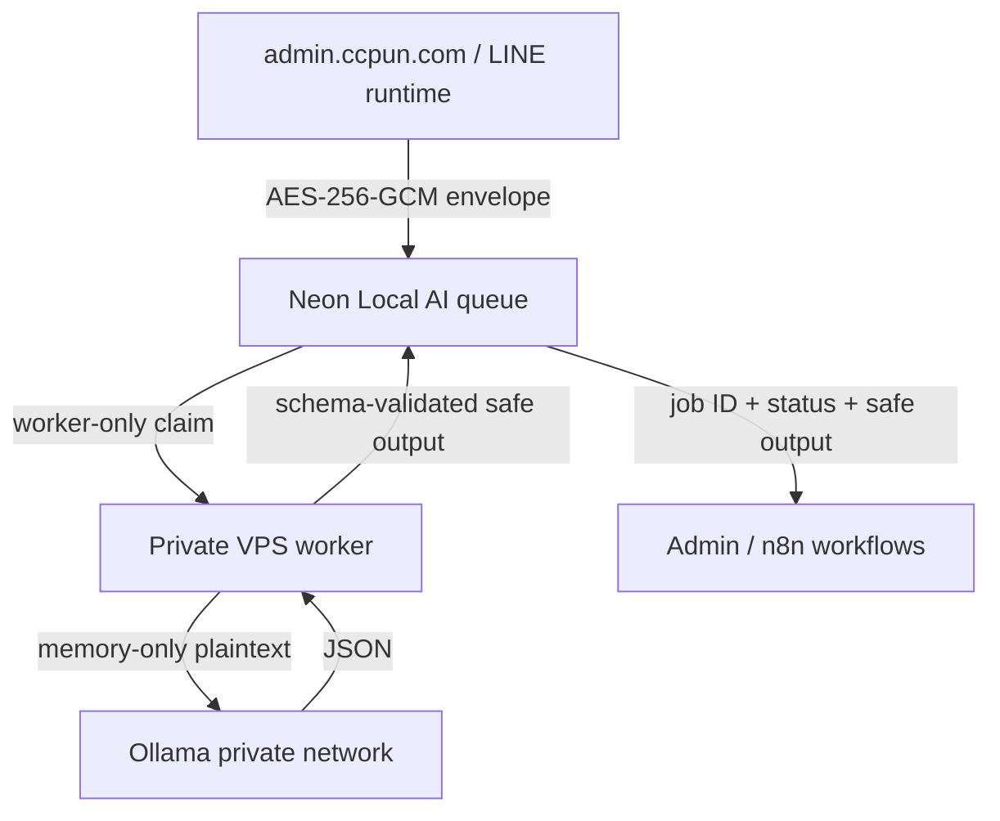

# CCPun Private Local-AI Enclave

Status: implementation-ready, activation pending UAT migration and Hostinger VPS access.

## Decision

CCPun may process customer-private data with a local model only inside the dedicated Private Local-AI Enclave. Cloud AI, MCP tools and n8n AI nodes remain prohibited from receiving raw customer data.

The first runtime target is the existing 8 GB Hostinger VPS with Ollama `qwen3:1.7b`, one loaded model and concurrency 1. This adds no new paid infrastructure.

## Boundary rules

| Component | May see raw customer payload | May see decryption key | May call Ollama | May see validated output |
|---|---:|---:|---:|---:|
| Admin server enqueue path | yes, transiently | yes | no | yes |
| Neon queue tables | no, ciphertext only | no | no | yes |
| VPS worker | yes, memory only | yes | yes | yes |
| Ollama container | yes, inference memory only | no | n/a | yes |
| n8n | no | no | no | yes |
| MCP / cloud AI | no | no | no | no |
| browser/client | no | no | no | owner-safe read model only |

Raw prompts and model responses must never enter logs, traces, job events or Admin read models. The worker logs only job ID, task type, state and normalized error category. Swap is expected to be disabled at host level for the enclave because plaintext exists briefly in process memory.

## Task policy

| Task | Data class | Local model | Output boundary |
|---|---|---|---|
| PII redaction | `customer-private` | allowed when private kill switch is on | redacted text + PII categories; direct identifier scan |
| LINE interest routing | `customer-private` | allowed when private kill switch is on | enums/tags/reason codes only; no customer quote or summary |
| Content operations | `public-safe` | allowed | category, tags, slug, excerpt, FAQ candidates |
| SEO preprocessing | `public-safe` | allowed | clusters and owner candidates |

The model is a processor, not an approval authority. Publishing, outbound LINE delivery, customer record mutation and Production promotion remain human/provider gated.

## Durable contract

- Admin encrypts input with AES-256-GCM before queue insertion. AAD binds key version, task type and job ID.
- `ccpun_admin_runtime` may enqueue and read only safe job fields through security-definer functions.
- `ccpun_local_ai_runtime` is `NOINHERIT`, cannot select queue tables, and may execute only claim/complete/fail/heartbeat functions.
- Worker claims one job with a hashed lease token; expired leases are requeued until the bounded attempt limit.
- Customer-private jobs are invisible to the claim function while `CCPUN_LOCAL_AI_PRIVATE_JOBS_ENABLED=false`.
- Worker validates decrypted input and model output against task-specific strict schemas before completion.
- `reconciliation-required` is terminal and requires an owner investigation; no automated side effect follows it.

## Admin and n8n integration

`Operations → Local AI` in Admin is the owner read model for worker heartbeat, queue counts, attempts and normalized failures. It deliberately excludes ciphertext, prompts, keys and raw payloads.

n8n remains an orchestration consumer around the enclave, not the inference transport. Workflows may receive an opaque job ID, poll status, branch on validated enum/tag output and trigger approved downstream work. They must not connect to Ollama, receive ciphertext or hold the encryption key.

The authenticated bridge is `POST /api/internal/local-ai/jobs/` for public-safe tasks and `GET /api/internal/local-ai/jobs/{jobId}/` for safe status/result reads. The bridge is fail-closed behind `CCPUN_LOCAL_AI_N8N_ENABLED` and a high-entropy bearer token shared only between Admin and n8n. Private tasks cannot be submitted through the n8n POST route.

## VPS runtime

`workers/local-ai/docker-compose.yml` creates two networks. Ollama joins only the internal model network and publishes no host port. The worker joins that network plus an egress network needed for the exact Neon endpoint. Runtime defaults cap Ollama at one loaded model and one parallel request, with a 5.5 GB memory limit; the worker is capped at 512 MB.

Activation steps:

1. prepare and test the additive migration on a temporary UAT branch;
2. approve and apply it to UAT;
3. assign a password to `ccpun_local_ai_runtime` without exposing it to Admin or source control;
4. generate one 32-byte base64 envelope key and install the same version in Admin UAT and the worker secret file;
5. create `.env.local-ai` on the VPS with mode `0600`, keep private jobs disabled, and start the compose stack;
6. verify heartbeat and public-safe fixtures in Admin;
7. enable private jobs and run synthetic Thai LINE/PII fixtures; then confirm no raw values appear in logs, n8n or Admin;
8. repeat through the Production approval path with distinct database credentials and a separately managed production key.

No Production migration, key activation or VPS deployment is implied by merging the code.
